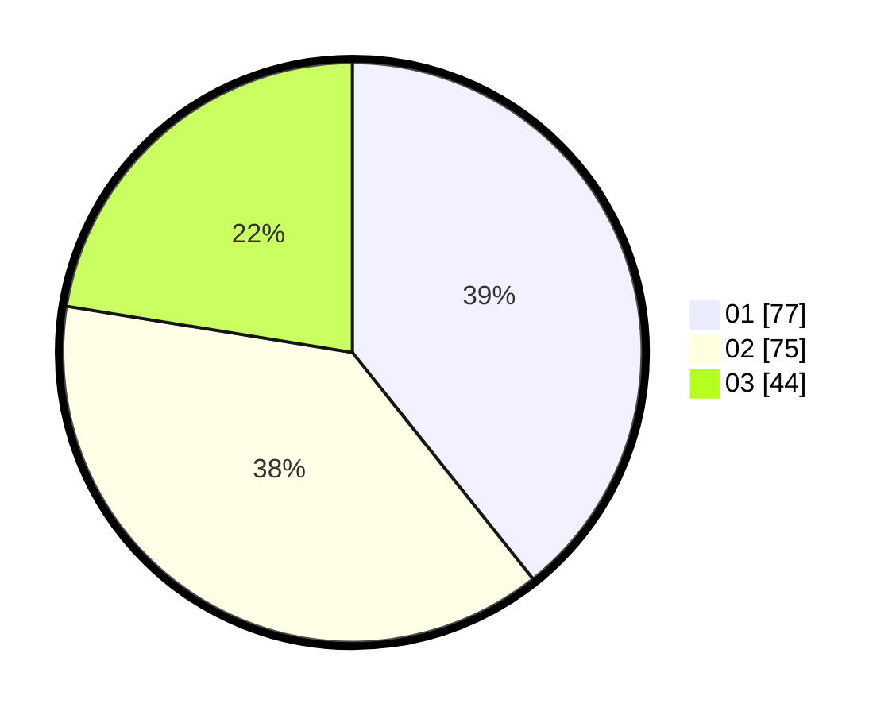

# Hasil

Hasil perolehan suara paslon dapat dilihat pada file paslon-01.txt, paslon-02.txt, dan paslon-03.txt.

Jika tidak ada, artinya data tersebut belum ada pada SIREKAP.

## Perolehan Suara

 * Paslon 01: **77**.
 * Paslon 02: **75**.
 * Paslon 03: **44**.

## Foto C Plano

https://sirekap-obj-formc.kpu.go.id/8afb/pemilu/ppwp/31/73/07/10/05/3173071005008-20240214-190525--560c80ea-ed14-450a-8fd8-135ba0cdc452.jpg

https://sirekap-obj-formc.kpu.go.id/8afb/pemilu/ppwp/31/73/07/10/05/3173071005008-20240214-184932--1d8bd196-4369-4ee5-b3b3-721145b15e23.jpg

https://sirekap-obj-formc.kpu.go.id/8afb/pemilu/ppwp/31/73/07/10/05/3173071005008-20240214-184957--8abf6893-7ac3-42e9-ba61-2a96a0045260.jpg

## DATA PEMILIH TETAP

Jumlah pemilih dalam DPT: **233**.
 * L: **105**.
 * P: **128**.

## DATA PENGGUNA HAK PILIH

Jumlah pengguna hak pilih dalam DPT: **189**.
 * L: **78**.
 * P: **111**.

Jumlah pengguna hak pilih dalam DPTb: **11**.
 * L: **5**.
 * P: **6**.

Jumlah pengguna hak pilih dalam DPK: **2**.
 * L: **0**.
 * P: **2**.

Jumlah pengguna hak pilih: **202**.
 * L: **83**.
 * P: **119**.

## JUMLAH SUARA SAH DAN TIDAK SAH

JUMLAH SELURUH SUARA SAH: **196**.

JUMLAH SUARA TIDAK SAH: **6**.

JUMLAH SELURUH SUARA SAH DAN SUARA TIDAK SAH: **202**.
