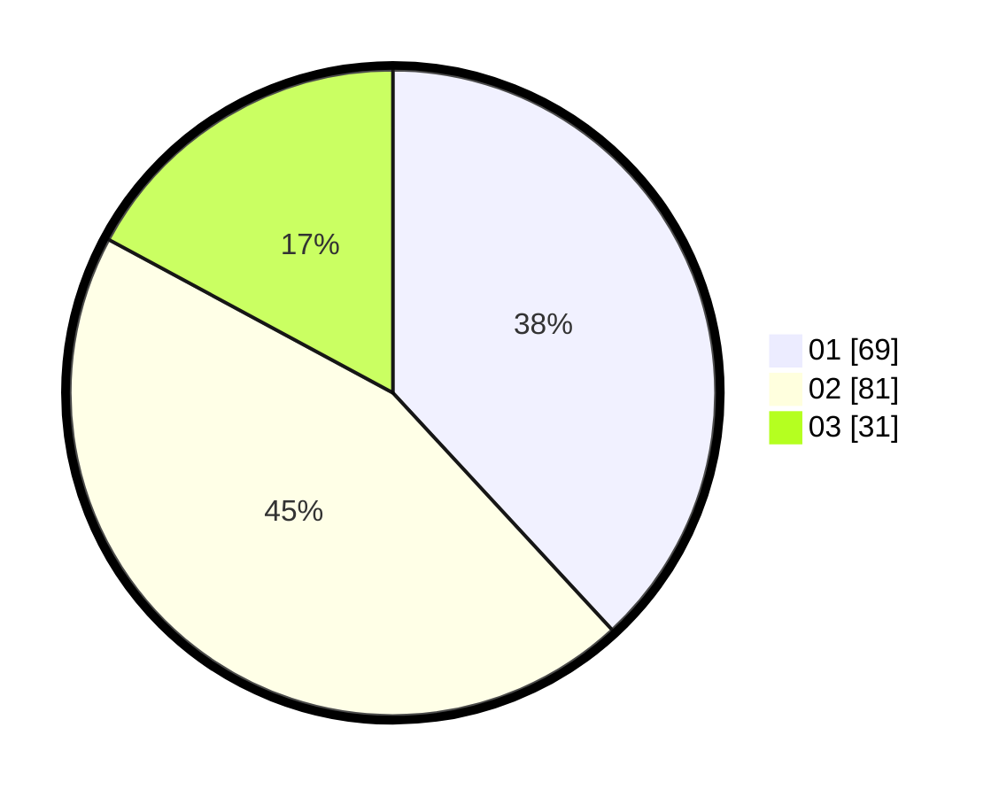

# Hasil

Hasil perolehan suara paslon dapat dilihat pada file paslon-01.txt, paslon-02.txt, dan paslon-03.txt.

Jika tidak ada, artinya data tersebut belum ada pada SIREKAP.

## Perolehan Suara

 * Paslon 01: **69**.
 * Paslon 02: **81**.
 * Paslon 03: **31**.

## Foto C Plano

https://sirekap-obj-formc.kpu.go.id/ac4c/pemilu/ppwp/31/73/07/10/05/3173071005009-20240215-022503--79fee8ee-0c38-4c64-895f-04f53fb68d8c.jpg

https://sirekap-obj-formc.kpu.go.id/ac4c/pemilu/ppwp/31/73/07/10/05/3173071005009-20240215-021854--faa46d41-6dd6-45d6-91ab-962fd78b48e8.jpg

https://sirekap-obj-formc.kpu.go.id/ac4c/pemilu/ppwp/31/73/07/10/05/3173071005009-20240215-022642--c1acea8c-42e2-43b7-8147-430122efd36e.jpg
