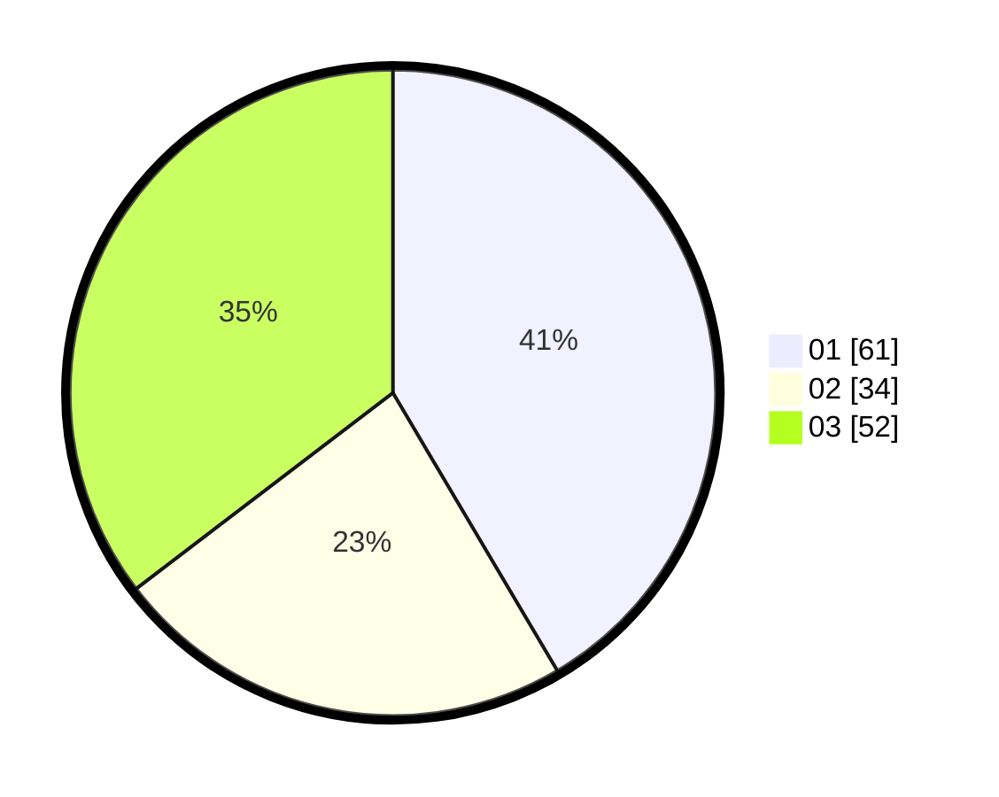

# Hasil

Hasil perolehan suara paslon dapat dilihat pada file paslon-01.txt, paslon-02.txt, dan paslon-03.txt.

Jika tidak ada, artinya data tersebut belum ada pada SIREKAP.

## Perolehan Suara

 * Paslon 01: **61**.
 * Paslon 02: **34**.
 * Paslon 03: **52**.

## Foto C Plano

https://sirekap-obj-formc.kpu.go.id/1aba/pemilu/ppwp/31/73/07/10/05/3173071005010-20240214-191433--85b8dd67-4f27-4928-ba67-089a7b43c96c.jpg

https://sirekap-obj-formc.kpu.go.id/1aba/pemilu/ppwp/31/73/07/10/05/3173071005010-20240214-200816--cab2cb04-20ba-4a18-b241-04c53fd20e1f.jpg

https://sirekap-obj-formc.kpu.go.id/1aba/pemilu/ppwp/31/73/07/10/05/3173071005010-20240214-201012--daa7cc68-a684-4e82-bef7-6480edde86cb.jpg

## DATA PEMILIH TETAP

Jumlah pemilih dalam DPT: **205**.
 * L: **100**.
 * P: **105**.

## DATA PENGGUNA HAK PILIH

Jumlah pengguna hak pilih dalam DPT: **144**.
 * L: **75**.
 * P: **69**.

Jumlah pengguna hak pilih dalam DPTb: **6**.
 * L: **1**.
 * P: **5**.

Jumlah pengguna hak pilih dalam DPK: **0**.
 * L: **0**.
 * P: **0**.

Jumlah pengguna hak pilih: **150**.
 * L: **76**.
 * P: **74**.

## JUMLAH SUARA SAH DAN TIDAK SAH

JUMLAH SELURUH SUARA SAH: **147**.

JUMLAH SUARA TIDAK SAH: **3**.

JUMLAH SELURUH SUARA SAH DAN SUARA TIDAK SAH: **150**.
