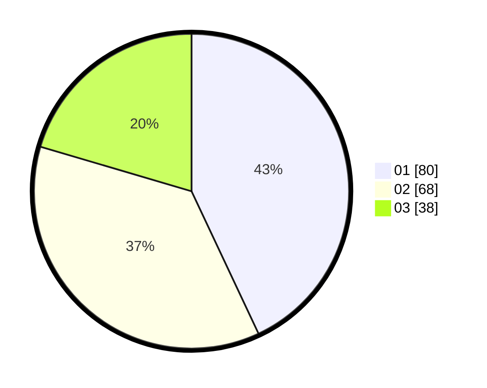

# Hasil

Hasil perolehan suara paslon dapat dilihat pada file paslon-01.txt, paslon-02.txt, dan paslon-03.txt.

Jika tidak ada, artinya data tersebut belum ada pada SIREKAP.

## Perolehan Suara

 * Paslon 01: **80**.
 * Paslon 02: **68**.
 * Paslon 03: **38**.

## Foto C Plano

https://sirekap-obj-formc.kpu.go.id/33ee/pemilu/ppwp/31/73/07/10/05/3173071005011-20240215-004422--5b5e7ba4-c819-4f78-9de5-26c5494f3c13.jpg

https://sirekap-obj-formc.kpu.go.id/33ee/pemilu/ppwp/31/73/07/10/05/3173071005011-20240214-184434--11aef1b2-563f-4772-90de-89237372066f.jpg

https://sirekap-obj-formc.kpu.go.id/33ee/pemilu/ppwp/31/73/07/10/05/3173071005011-20240215-004233--6b98fde5-19d5-419d-83c5-68fe50b91366.jpg
