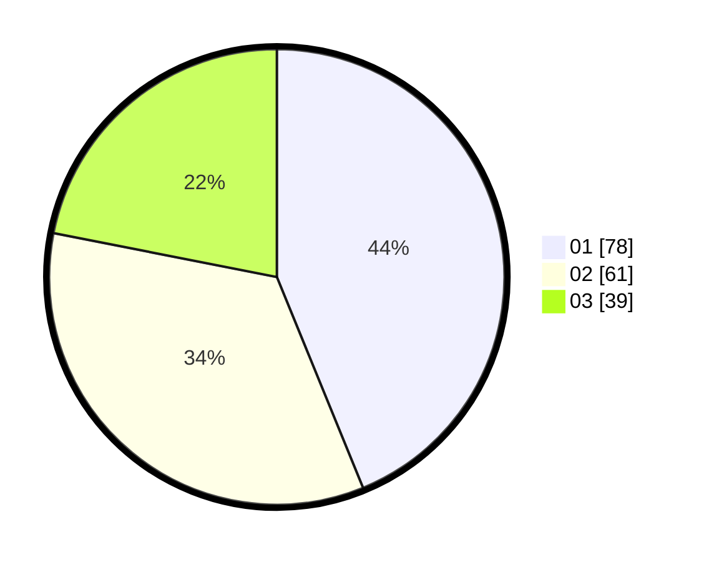

# Hasil

Hasil perolehan suara paslon dapat dilihat pada file paslon-01.txt, paslon-02.txt, dan paslon-03.txt.

Jika tidak ada, artinya data tersebut belum ada pada SIREKAP.

## Perolehan Suara

 * Paslon 01: **78**.
 * Paslon 02: **61**.
 * Paslon 03: **39**.

## Foto C Plano

https://sirekap-obj-formc.kpu.go.id/a001/pemilu/ppwp/31/73/07/10/05/3173071005015-20240214-160102--0236bdf8-3f4e-4b82-a359-8ae3459be115.jpg

https://sirekap-obj-formc.kpu.go.id/a001/pemilu/ppwp/31/73/07/10/05/3173071005015-20240214-192715--a4f38fb1-e252-479b-8f27-ee316b1cec64.jpg

https://sirekap-obj-formc.kpu.go.id/a001/pemilu/ppwp/31/73/07/10/05/3173071005015-20240214-155808--14c384c0-4fcc-454f-bee0-9ffc252132a0.jpg
