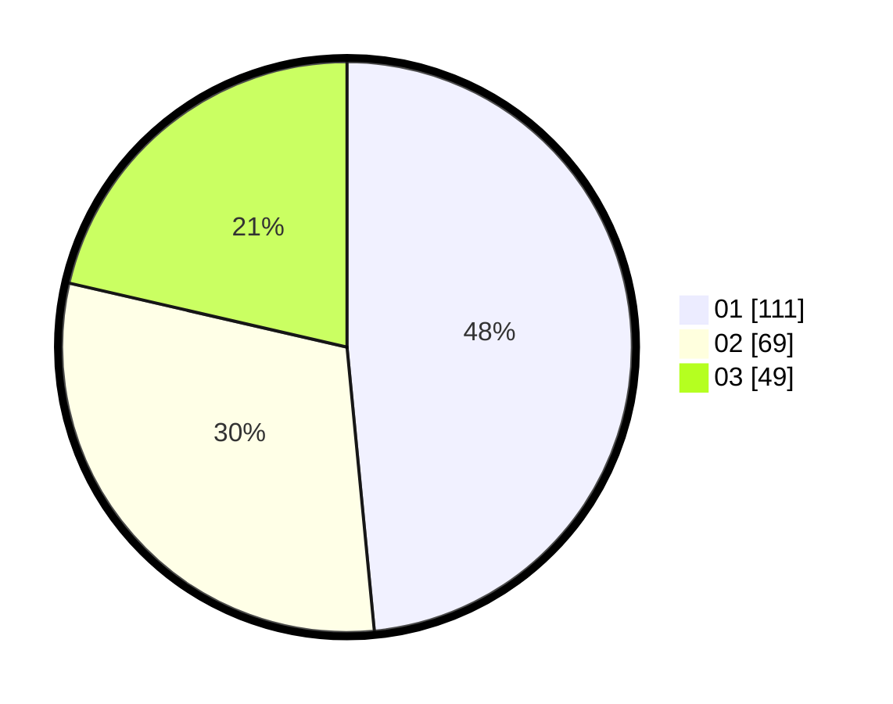

# Hasil

Hasil perolehan suara paslon dapat dilihat pada file paslon-01.txt, paslon-02.txt, dan paslon-03.txt.

Jika tidak ada, artinya data tersebut belum ada pada SIREKAP.

## Perolehan Suara

 * Paslon 01: **111**.
 * Paslon 02: **69**.
 * Paslon 03: **49**.

## Foto C Plano

https://sirekap-obj-formc.kpu.go.id/809f/pemilu/ppwp/31/73/07/10/05/3173071005018-20240214-194949--7a390044-528b-4fc8-8439-0255a0c6c664.jpg

https://sirekap-obj-formc.kpu.go.id/809f/pemilu/ppwp/31/73/07/10/05/3173071005018-20240214-203025--04bb702e-9d9e-4589-ae5c-bc0fe0a9a3c7.jpg

https://sirekap-obj-formc.kpu.go.id/809f/pemilu/ppwp/31/73/07/10/05/3173071005018-20240214-203218--d465fb2c-20de-4c62-8f82-29e4bc69486a.jpg

## DATA PEMILIH TETAP

Jumlah pemilih dalam DPT: **276**.
 * L: **135**.
 * P: **141**.

## DATA PENGGUNA HAK PILIH

Jumlah pengguna hak pilih dalam DPT: **221**.
 * L: **106**.
 * P: **115**.

Jumlah pengguna hak pilih dalam DPTb: **13**.
 * L: **5**.
 * P: **8**.

Jumlah pengguna hak pilih dalam DPK: **0**.
 * L: **0**.
 * P: **0**.

Jumlah pengguna hak pilih: **234**.
 * L: **111**.
 * P: **123**.

## JUMLAH SUARA SAH DAN TIDAK SAH

JUMLAH SELURUH SUARA SAH: **229**.

JUMLAH SUARA TIDAK SAH: **5**.

JUMLAH SELURUH SUARA SAH DAN SUARA TIDAK SAH: **234**.
