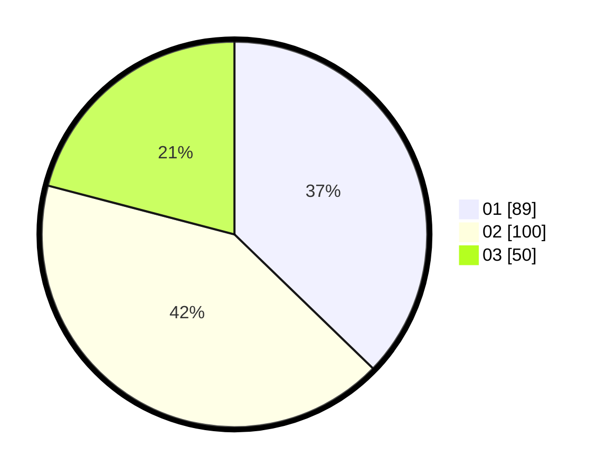

# Hasil

Hasil perolehan suara paslon dapat dilihat pada file paslon-01.txt, paslon-02.txt, dan paslon-03.txt.

Jika tidak ada, artinya data tersebut belum ada pada SIREKAP.

## Perolehan Suara

 * Paslon 01: **89**.
 * Paslon 02: **100**.
 * Paslon 03: **50**.

## Foto C Plano

https://sirekap-obj-formc.kpu.go.id/ccac/pemilu/ppwp/31/73/07/10/05/3173071005025-20240214-155410--5a0545bb-038d-4cf8-a324-3818d2bbf98e.jpg

https://sirekap-obj-formc.kpu.go.id/ccac/pemilu/ppwp/31/73/07/10/05/3173071005025-20240214-155453--8661c322-cb42-4c62-8103-358fad9c4377.jpg

https://sirekap-obj-formc.kpu.go.id/ccac/pemilu/ppwp/31/73/07/10/05/3173071005025-20240214-155539--a5c26f61-05a8-4b82-a541-50b2e241aeac.jpg

## DATA PEMILIH TETAP

Jumlah pemilih dalam DPT: **269**.
 * L: **139**.
 * P: **130**.

## DATA PENGGUNA HAK PILIH

Jumlah pengguna hak pilih dalam DPT: **235**.
 * L: **124**.
 * P: **111**.

Jumlah pengguna hak pilih dalam DPTb: **0**.
 * L: **0**.
 * P: **0**.

Jumlah pengguna hak pilih dalam DPK: **8**.
 * L: **3**.
 * P: **5**.

Jumlah pengguna hak pilih: **243**.
 * L: **127**.
 * P: **116**.

## JUMLAH SUARA SAH DAN TIDAK SAH

JUMLAH SELURUH SUARA SAH: **239**.

JUMLAH SUARA TIDAK SAH: **4**.

JUMLAH SELURUH SUARA SAH DAN SUARA TIDAK SAH: **243**.
