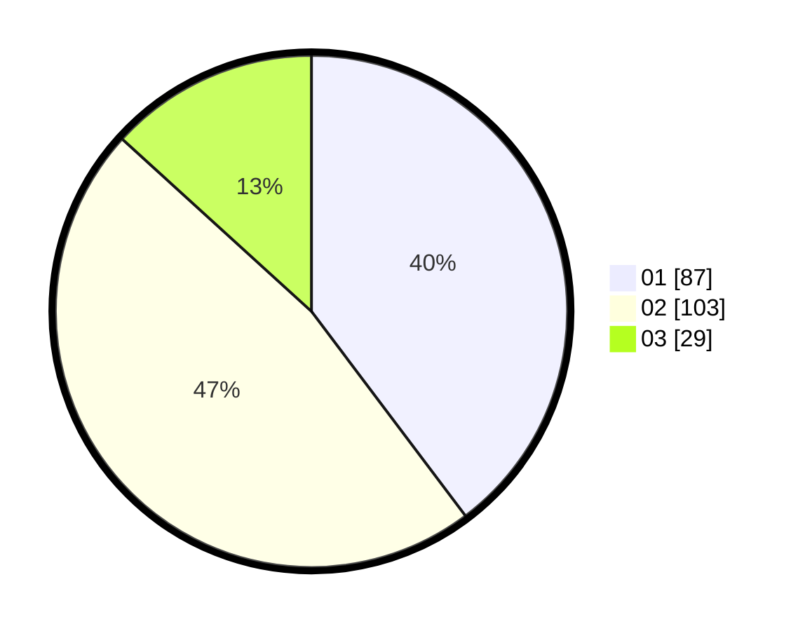

# Hasil

Hasil perolehan suara paslon dapat dilihat pada file paslon-01.txt, paslon-02.txt, dan paslon-03.txt.

Jika tidak ada, artinya data tersebut belum ada pada SIREKAP.

## Perolehan Suara

 * Paslon 01: **87**.
 * Paslon 02: **103**.
 * Paslon 03: **29**.

## Foto C Plano

https://sirekap-obj-formc.kpu.go.id/694b/pemilu/ppwp/31/73/07/10/05/3173071005029-20240214-210151--b0a7ef27-6f31-4c0a-ba3f-df60ced5fc8a.jpg

https://sirekap-obj-formc.kpu.go.id/694b/pemilu/ppwp/31/73/07/10/05/3173071005029-20240214-200847--cbba65f0-3638-46f5-9446-774caa668402.jpg

https://sirekap-obj-formc.kpu.go.id/694b/pemilu/ppwp/31/73/07/10/05/3173071005029-20240214-201037--d5fa0954-b9a0-4c3c-91bd-1b5aa5e03028.jpg
