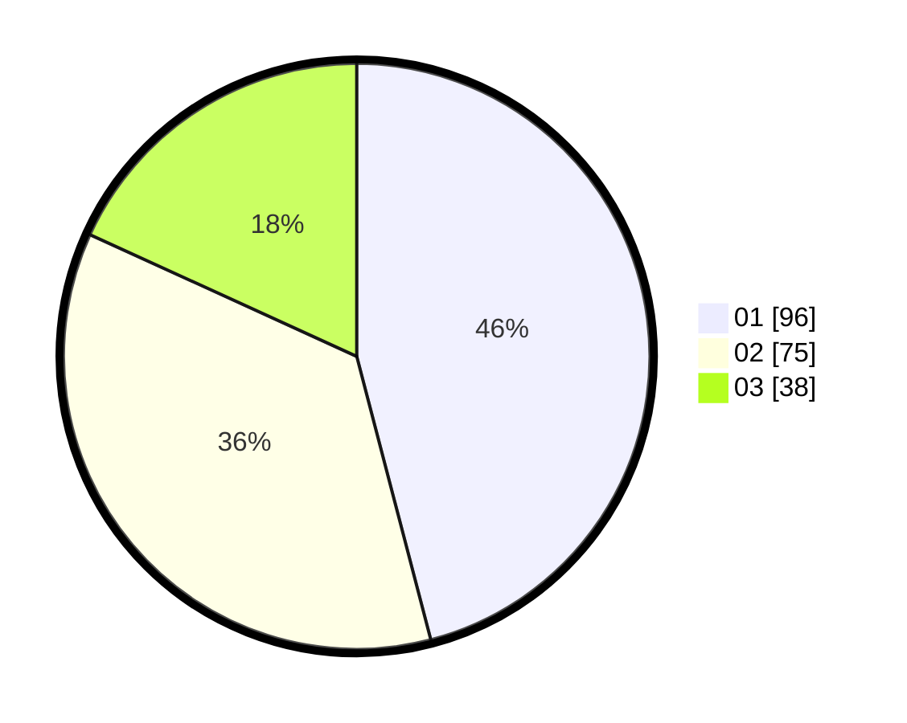

# Hasil

Hasil perolehan suara paslon dapat dilihat pada file paslon-01.txt, paslon-02.txt, dan paslon-03.txt.

Jika tidak ada, artinya data tersebut belum ada pada SIREKAP.

## Perolehan Suara

 * Paslon 01: **96**.
 * Paslon 02: **75**.
 * Paslon 03: **38**.

## Foto C Plano

https://sirekap-obj-formc.kpu.go.id/3c1d/pemilu/ppwp/31/73/07/10/05/3173071005033-20240215-214637--30b55fce-0423-4c3d-a708-a06a0559e0d1.jpg

https://sirekap-obj-formc.kpu.go.id/3c1d/pemilu/ppwp/31/73/07/10/05/3173071005033-20240215-214649--ee7b9f26-2d5f-4eb9-8b34-1394cd77e4f8.jpg

https://sirekap-obj-formc.kpu.go.id/3c1d/pemilu/ppwp/31/73/07/10/05/3173071005033-20240215-214701--3a697226-4a2a-445a-9488-afe60100ccb4.jpg
