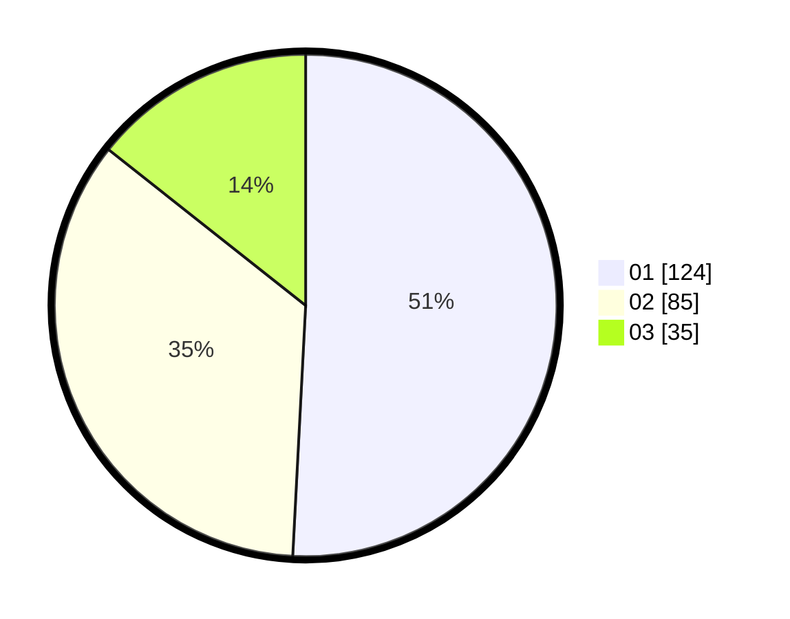

# Hasil

Hasil perolehan suara paslon dapat dilihat pada file paslon-01.txt, paslon-02.txt, dan paslon-03.txt.

Jika tidak ada, artinya data tersebut belum ada pada SIREKAP.

## Perolehan Suara

 * Paslon 01: **124**.
 * Paslon 02: **85**.
 * Paslon 03: **35**.

## Foto C Plano

https://sirekap-obj-formc.kpu.go.id/3ea9/pemilu/ppwp/31/73/07/10/05/3173071005034-20240214-155835--30be047b-befd-4963-89a1-dfa1c9c572e3.jpg

https://sirekap-obj-formc.kpu.go.id/3ea9/pemilu/ppwp/31/73/07/10/05/3173071005034-20240214-160105--fd5fb622-d59a-45e6-995e-ef98bd2f1c43.jpg
