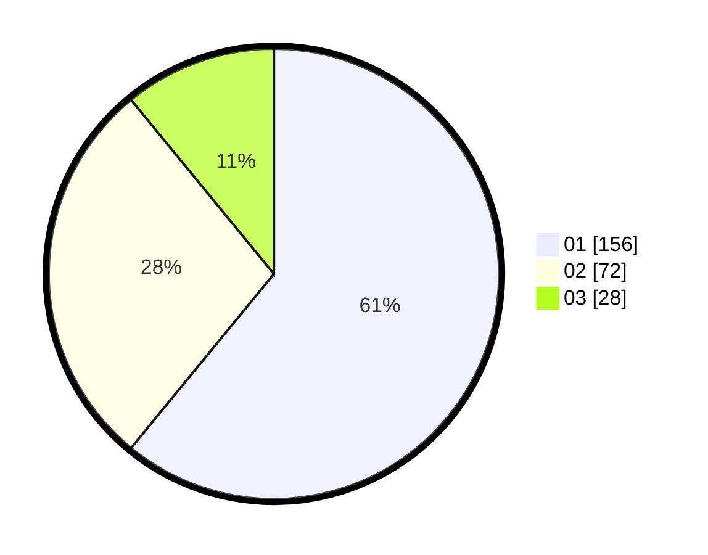

# Hasil

Hasil perolehan suara paslon dapat dilihat pada file paslon-01.txt, paslon-02.txt, dan paslon-03.txt.

Jika tidak ada, artinya data tersebut belum ada pada SIREKAP.

## Perolehan Suara

 * Paslon 01: **156**.
 * Paslon 02: **72**.
 * Paslon 03: **28**.

## Foto C Plano

https://sirekap-obj-formc.kpu.go.id/ac17/pemilu/ppwp/31/73/07/10/05/3173071005035-20240214-185412--0142a26e-6f98-45e3-8788-895fe2c61d1a.jpg

https://sirekap-obj-formc.kpu.go.id/ac17/pemilu/ppwp/31/73/07/10/05/3173071005035-20240214-225513--76289733-a6ca-43e7-9e55-7e2dd73f2f0b.jpg

https://sirekap-obj-formc.kpu.go.id/ac17/pemilu/ppwp/31/73/07/10/05/3173071005035-20240214-230412--7f40e991-71cd-411f-ba88-f043e6d2a6f2.jpg
