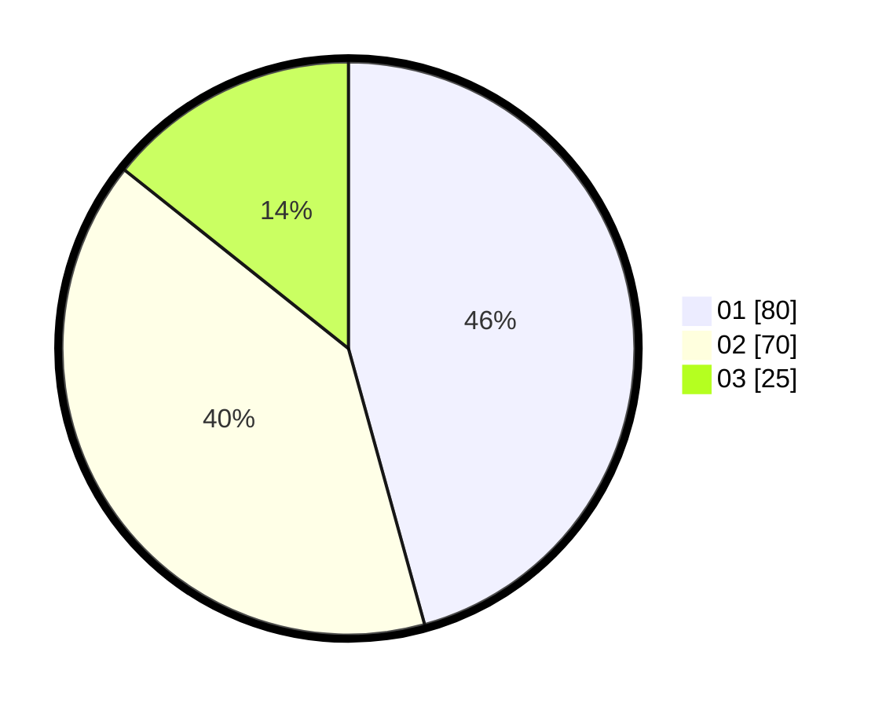

# Hasil

Hasil perolehan suara paslon dapat dilihat pada file paslon-01.txt, paslon-02.txt, dan paslon-03.txt.

Jika tidak ada, artinya data tersebut belum ada pada SIREKAP.

## Perolehan Suara

 * Paslon 01: **80**.
 * Paslon 02: **70**.
 * Paslon 03: **25**.

## Foto C Plano

https://sirekap-obj-formc.kpu.go.id/e524/pemilu/ppwp/31/73/07/10/05/3173071005036-20240214-155147--16a84b95-3bfe-4786-a6e8-2d46bd37515f.jpg

https://sirekap-obj-formc.kpu.go.id/e524/pemilu/ppwp/31/73/07/10/05/3173071005036-20240214-155151--b1c41ca8-8901-4ca5-a1d2-2c8a0b9935cd.jpg

https://sirekap-obj-formc.kpu.go.id/e524/pemilu/ppwp/31/73/07/10/05/3173071005036-20240214-155155--1aa5e6f2-3390-4340-b1d3-685ad2917bae.jpg
