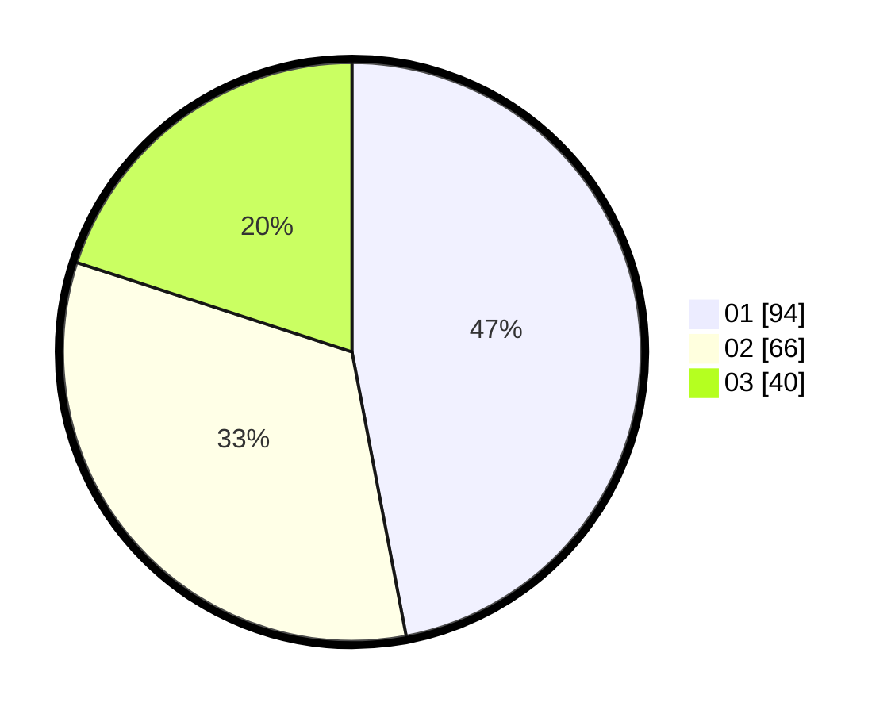

# Hasil

Hasil perolehan suara paslon dapat dilihat pada file paslon-01.txt, paslon-02.txt, dan paslon-03.txt.

Jika tidak ada, artinya data tersebut belum ada pada SIREKAP.

## Perolehan Suara

 * Paslon 01: **94**.
 * Paslon 02: **66**.
 * Paslon 03: **40**.

## Foto C Plano

https://sirekap-obj-formc.kpu.go.id/d018/pemilu/ppwp/31/73/07/10/05/3173071005044-20240214-204301--6c9d9a60-dcb7-441b-a634-3a8cf44ca2ef.jpg

https://sirekap-obj-formc.kpu.go.id/d018/pemilu/ppwp/31/73/07/10/05/3173071005044-20240214-204412--9f37282d-b173-4178-bfcb-1671c3cec846.jpg

https://sirekap-obj-formc.kpu.go.id/d018/pemilu/ppwp/31/73/07/10/05/3173071005044-20240214-204900--8d2e176b-1a15-4f8f-b646-9930d67d6086.jpg

## DATA PEMILIH TETAP

Jumlah pemilih dalam DPT: **197**.
 * L: **100**.
 * P: **97**.

## DATA PENGGUNA HAK PILIH

Jumlah pengguna hak pilih dalam DPT: **197**.
 * L: **100**.
 * P: **97**.

Jumlah pengguna hak pilih dalam DPTb: **8**.
 * L: **3**.
 * P: **5**.

Jumlah pengguna hak pilih dalam DPK: **1**.
 * L: **0**.
 * P: **1**.

Jumlah pengguna hak pilih: **206**.
 * L: **103**.
 * P: **103**.

## JUMLAH SUARA SAH DAN TIDAK SAH

JUMLAH SELURUH SUARA SAH: **200**.

JUMLAH SUARA TIDAK SAH: **6**.

JUMLAH SELURUH SUARA SAH DAN SUARA TIDAK SAH: **206**.
