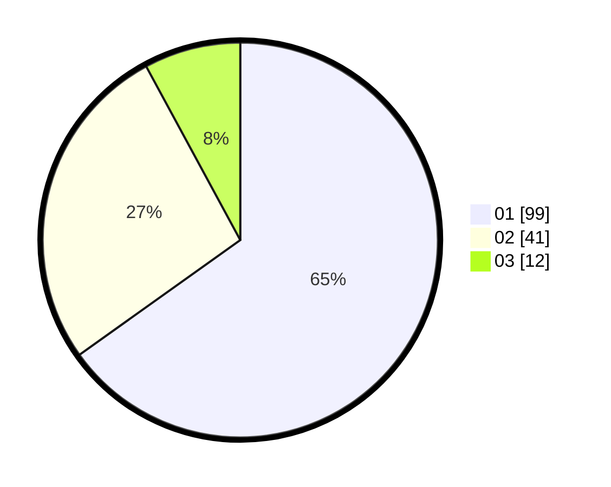

# Hasil

Hasil perolehan suara paslon dapat dilihat pada file paslon-01.txt, paslon-02.txt, dan paslon-03.txt.

Jika tidak ada, artinya data tersebut belum ada pada SIREKAP.

## Perolehan Suara

 * Paslon 01: **99**.
 * Paslon 02: **41**.
 * Paslon 03: **12**.

## Foto C Plano

https://sirekap-obj-formc.kpu.go.id/9e60/pemilu/ppwp/31/73/07/10/05/3173071005051-20240214-212119--5eb6f07a-1a0c-4240-a9f0-a7a61395cc21.jpg

https://sirekap-obj-formc.kpu.go.id/9e60/pemilu/ppwp/31/73/07/10/05/3173071005051-20240214-212316--388264e1-6dd6-4352-bf7b-c917b4cbecae.jpg

https://sirekap-obj-formc.kpu.go.id/9e60/pemilu/ppwp/31/73/07/10/05/3173071005051-20240214-212605--e9622f0b-933a-4f52-aeea-57a56b3685d2.jpg
