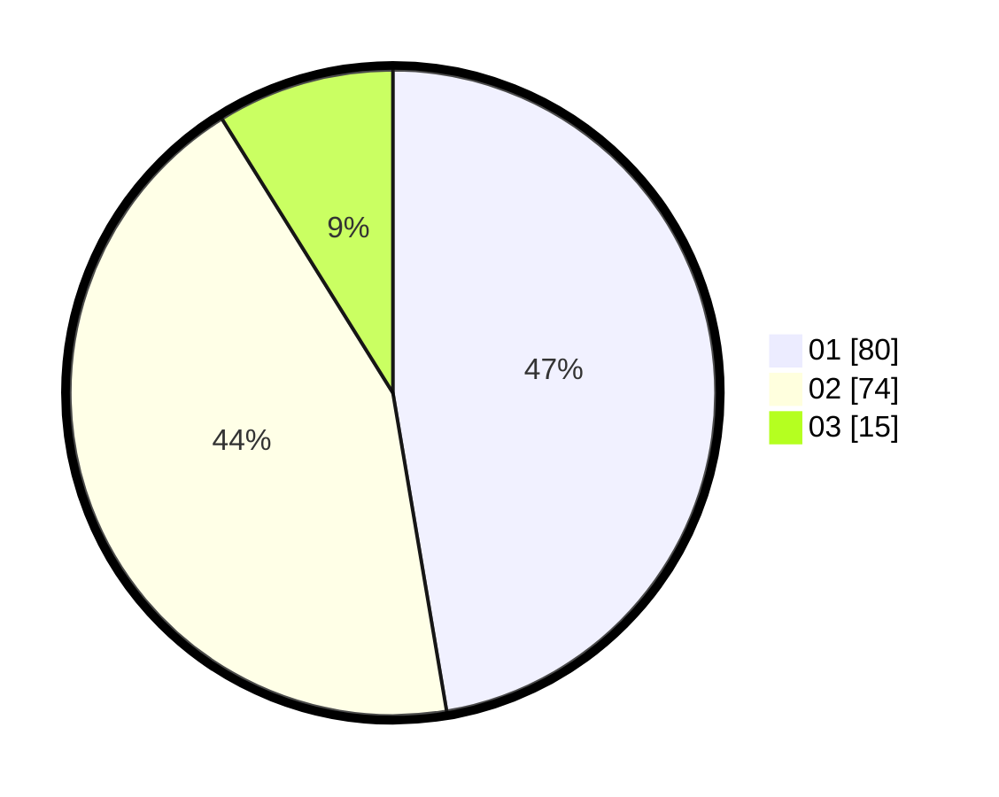

# Hasil

Hasil perolehan suara paslon dapat dilihat pada file paslon-01.txt, paslon-02.txt, dan paslon-03.txt.

Jika tidak ada, artinya data tersebut belum ada pada SIREKAP.

## Perolehan Suara

 * Paslon 01: **80**.
 * Paslon 02: **74**.
 * Paslon 03: **15**.

## Foto C Plano

https://sirekap-obj-formc.kpu.go.id/f2ae/pemilu/ppwp/31/73/07/10/05/3173071005053-20240214-215831--571ebf69-c2f4-4912-9dc8-6a9c99a4a405.jpg

https://sirekap-obj-formc.kpu.go.id/f2ae/pemilu/ppwp/31/73/07/10/05/3173071005053-20240214-220141--484f1ab8-3b27-4f6c-a0f2-5b906e9343c3.jpg

https://sirekap-obj-formc.kpu.go.id/f2ae/pemilu/ppwp/31/73/07/10/05/3173071005053-20240214-220223--81625c27-7678-4d50-a377-8ae6ec454f40.jpg
