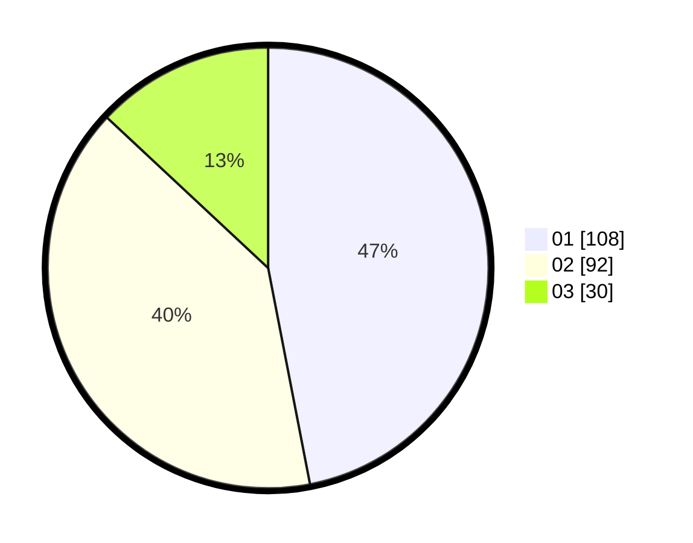

# Hasil

Hasil perolehan suara paslon dapat dilihat pada file paslon-01.txt, paslon-02.txt, dan paslon-03.txt.

Jika tidak ada, artinya data tersebut belum ada pada SIREKAP.

## Perolehan Suara

 * Paslon 01: **108**.
 * Paslon 02: **92**.
 * Paslon 03: **30**.

## Foto C Plano

https://sirekap-obj-formc.kpu.go.id/bcc7/pemilu/ppwp/31/73/07/10/05/3173071005056-20240215-000247--7edec1e0-88d8-4a09-a87c-ace84747af89.jpg

https://sirekap-obj-formc.kpu.go.id/bcc7/pemilu/ppwp/31/73/07/10/05/3173071005056-20240215-000318--909fff3b-04cd-4a06-8d25-e7341d429178.jpg

https://sirekap-obj-formc.kpu.go.id/bcc7/pemilu/ppwp/31/73/07/10/05/3173071005056-20240215-000339--72f0b14b-d04a-467d-9412-8c375ae7a8d5.jpg
