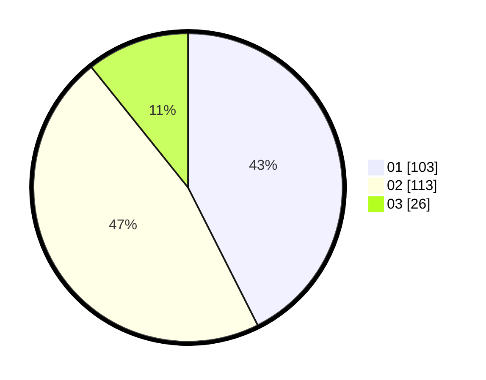

# Hasil

Hasil perolehan suara paslon dapat dilihat pada file paslon-01.txt, paslon-02.txt, dan paslon-03.txt.

Jika tidak ada, artinya data tersebut belum ada pada SIREKAP.

## Perolehan Suara

 * Paslon 01: **103**.
 * Paslon 02: **113**.
 * Paslon 03: **26**.

## Foto C Plano

https://sirekap-obj-formc.kpu.go.id/d71f/pemilu/ppwp/31/73/07/10/05/3173071005057-20240214-235244--cc533353-1c20-41e0-99f1-5b84d571c36c.jpg

https://sirekap-obj-formc.kpu.go.id/d71f/pemilu/ppwp/31/73/07/10/05/3173071005057-20240214-235347--5f05cae0-14ea-450f-b3d0-99d5dcace809.jpg

https://sirekap-obj-formc.kpu.go.id/d71f/pemilu/ppwp/31/73/07/10/05/3173071005057-20240214-235407--a177c010-b021-42b7-82ea-0154af250e44.jpg
