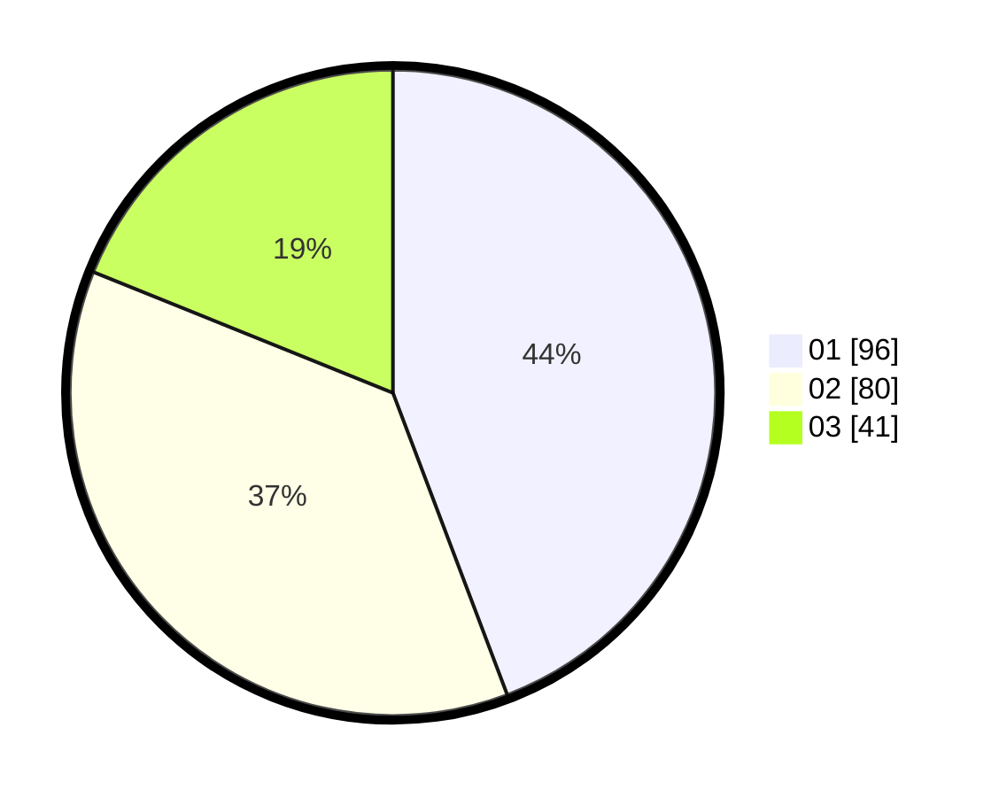

# Hasil

Hasil perolehan suara paslon dapat dilihat pada file paslon-01.txt, paslon-02.txt, dan paslon-03.txt.

Jika tidak ada, artinya data tersebut belum ada pada SIREKAP.

## Perolehan Suara

 * Paslon 01: **96**.
 * Paslon 02: **80**.
 * Paslon 03: **41**.

## Foto C Plano

https://sirekap-obj-formc.kpu.go.id/cc84/pemilu/ppwp/31/73/07/10/05/3173071005059-20240214-213333--be94f2c9-fcb1-46ae-b471-c0c586313fab.jpg

https://sirekap-obj-formc.kpu.go.id/cc84/pemilu/ppwp/31/73/07/10/05/3173071005059-20240214-214349--99d6977f-1b27-4bd1-b5b6-756db37bbfbb.jpg

https://sirekap-obj-formc.kpu.go.id/cc84/pemilu/ppwp/31/73/07/10/05/3173071005059-20240214-214433--ea2337e9-2ec7-488b-9813-0940d610110c.jpg
