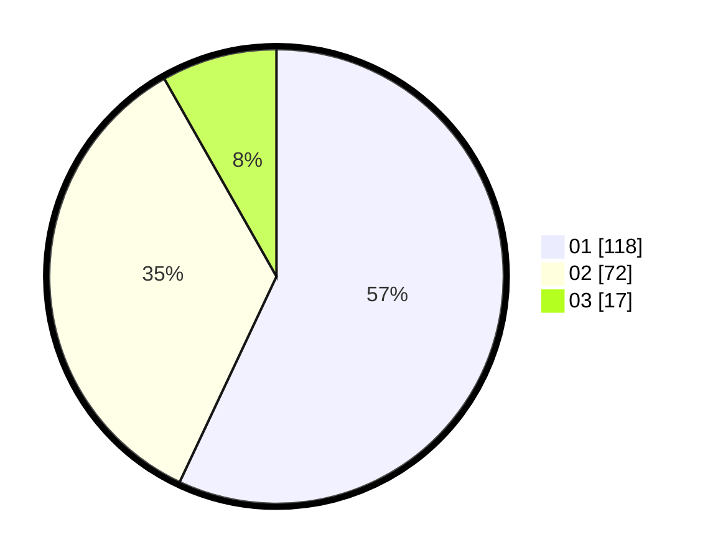

# Hasil

Hasil perolehan suara paslon dapat dilihat pada file paslon-01.txt, paslon-02.txt, dan paslon-03.txt.

Jika tidak ada, artinya data tersebut belum ada pada SIREKAP.

## Perolehan Suara

 * Paslon 01: **118**.
 * Paslon 02: **72**.
 * Paslon 03: **17**.

## Foto C Plano

https://sirekap-obj-formc.kpu.go.id/10d5/pemilu/ppwp/31/73/07/10/05/3173071005061-20240214-203723--4b9c8724-fa6d-4fbe-90d7-80ba110f943c.jpg

https://sirekap-obj-formc.kpu.go.id/10d5/pemilu/ppwp/31/73/07/10/05/3173071005061-20240214-212800--193af351-c51a-4f2b-b3dc-c7548ae96540.jpg

https://sirekap-obj-formc.kpu.go.id/10d5/pemilu/ppwp/31/73/07/10/05/3173071005061-20240214-204054--0ea31a0d-c9e1-40ba-9278-db8d390b504c.jpg

## DATA PEMILIH TETAP

Jumlah pemilih dalam DPT: **204**.
 * L: **105**.
 * P: **99**.

## DATA PENGGUNA HAK PILIH

Jumlah pengguna hak pilih dalam DPT: **204**.
 * L: **105**.
 * P: **99**.

Jumlah pengguna hak pilih dalam DPTb: **5**.
 * L: **3**.
 * P: **2**.

Jumlah pengguna hak pilih dalam DPK: **1**.
 * L: **0**.
 * P: **1**.

Jumlah pengguna hak pilih: **210**.
 * L: **108**.
 * P: **102**.

## JUMLAH SUARA SAH DAN TIDAK SAH

JUMLAH SELURUH SUARA SAH: **207**.

JUMLAH SUARA TIDAK SAH: **3**.

JUMLAH SELURUH SUARA SAH DAN SUARA TIDAK SAH: **210**.
