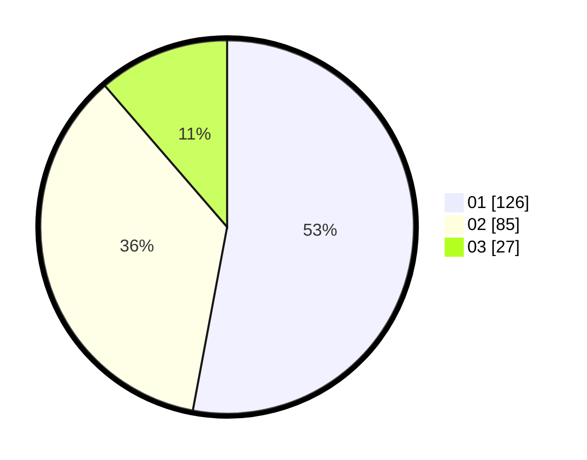

# Hasil

Hasil perolehan suara paslon dapat dilihat pada file paslon-01.txt, paslon-02.txt, dan paslon-03.txt.

Jika tidak ada, artinya data tersebut belum ada pada SIREKAP.

## Perolehan Suara

 * Paslon 01: **126**.
 * Paslon 02: **85**.
 * Paslon 03: **27**.

## Foto C Plano

https://sirekap-obj-formc.kpu.go.id/c769/pemilu/ppwp/31/73/07/10/05/3173071005062-20240216-134151--d3db1385-a584-4b51-af04-2c120f2b55bb.jpg

https://sirekap-obj-formc.kpu.go.id/c769/pemilu/ppwp/31/73/07/10/05/3173071005062-20240216-134232--70952b66-dfac-4967-b0b4-abcd7cffe42f.jpg
