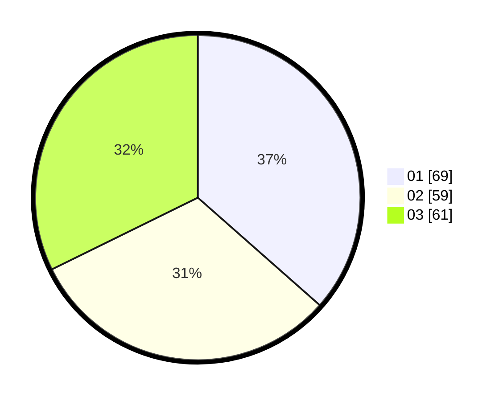

# Hasil

Hasil perolehan suara paslon dapat dilihat pada file paslon-01.txt, paslon-02.txt, dan paslon-03.txt.

Jika tidak ada, artinya data tersebut belum ada pada SIREKAP.

## Perolehan Suara

 * Paslon 01: **69**.
 * Paslon 02: **59**.
 * Paslon 03: **61**.

## Foto C Plano

https://sirekap-obj-formc.kpu.go.id/fb80/pemilu/ppwp/31/73/07/10/05/3173071005068-20240214-191400--aea2795a-ab60-42d6-8ed4-78d2cd299e04.jpg

https://sirekap-obj-formc.kpu.go.id/fb80/pemilu/ppwp/31/73/07/10/05/3173071005068-20240214-203723--67528537-987f-4bad-809b-a01dfe5fb000.jpg
