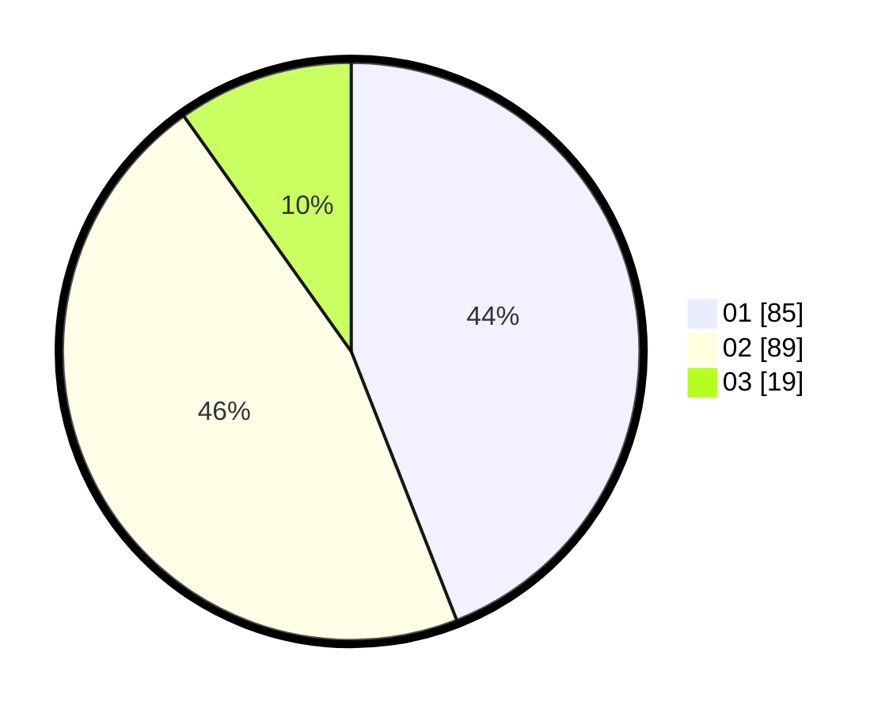

# Hasil

Hasil perolehan suara paslon dapat dilihat pada file paslon-01.txt, paslon-02.txt, dan paslon-03.txt.

Jika tidak ada, artinya data tersebut belum ada pada SIREKAP.

## Perolehan Suara

 * Paslon 01: **85**.
 * Paslon 02: **89**.
 * Paslon 03: **19**.

## Foto C Plano

https://sirekap-obj-formc.kpu.go.id/9584/pemilu/ppwp/31/73/07/10/05/3173071005069-20240215-213145--d4f9630a-92d5-41ab-890c-40d68ccfe957.jpg

https://sirekap-obj-formc.kpu.go.id/9584/pemilu/ppwp/31/73/07/10/05/3173071005069-20240215-213141--e658df21-09c6-4ed3-9999-d7e361997dbb.jpg

https://sirekap-obj-formc.kpu.go.id/9584/pemilu/ppwp/31/73/07/10/05/3173071005069-20240215-213134--9ccb36bf-c427-47b4-bd1e-5a97b6c1e123.jpg

## DATA PEMILIH TETAP

Jumlah pemilih dalam DPT: **186**.
 * L: **96**.
 * P: **90**.

## DATA PENGGUNA HAK PILIH

Jumlah pengguna hak pilih dalam DPT: **186**.
 * L: **96**.
 * P: **90**.

Jumlah pengguna hak pilih dalam DPTb: **5**.
 * L: **1**.
 * P: **4**.

Jumlah pengguna hak pilih dalam DPK: **5**.
 * L: **1**.
 * P: **4**.

Jumlah pengguna hak pilih: **196**.
 * L: **98**.
 * P: **98**.

## JUMLAH SUARA SAH DAN TIDAK SAH

JUMLAH SELURUH SUARA SAH: **193**.

JUMLAH SUARA TIDAK SAH: **3**.

JUMLAH SELURUH SUARA SAH DAN SUARA TIDAK SAH: **196**.
