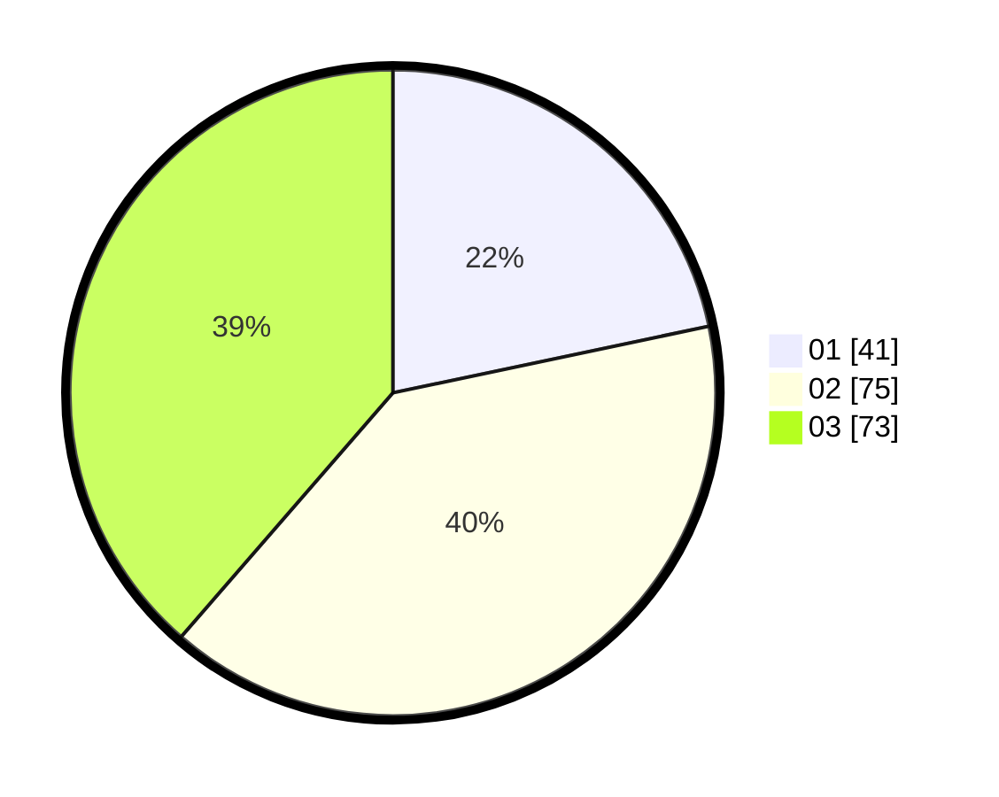

# Hasil

Hasil perolehan suara paslon dapat dilihat pada file paslon-01.txt, paslon-02.txt, dan paslon-03.txt.

Jika tidak ada, artinya data tersebut belum ada pada SIREKAP.

## Perolehan Suara

 * Paslon 01: **41**.
 * Paslon 02: **75**.
 * Paslon 03: **73**.

## Foto C Plano

https://sirekap-obj-formc.kpu.go.id/c47f/pemilu/ppwp/31/73/07/10/05/3173071005071-20240215-001940--3aafdd2d-9a07-4a35-b766-a1e0f51e09c5.jpg

https://sirekap-obj-formc.kpu.go.id/c47f/pemilu/ppwp/31/73/07/10/05/3173071005071-20240215-002044--5d68826b-89d4-4a89-b657-1b3084edd182.jpg
