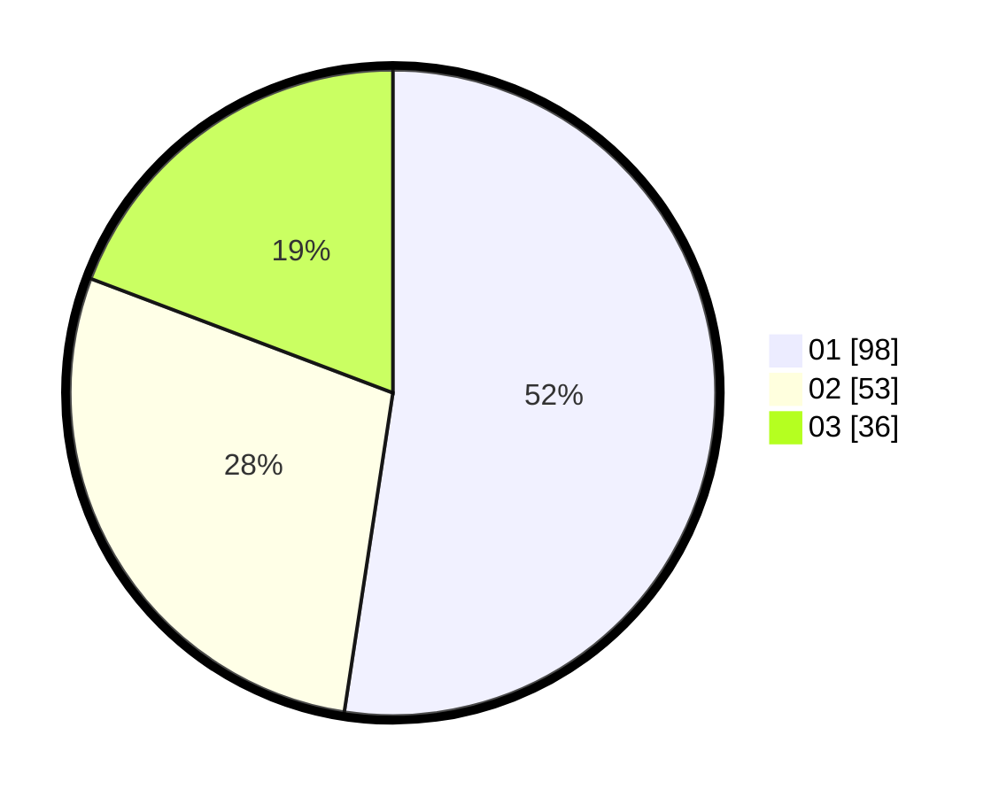

# Hasil

Hasil perolehan suara paslon dapat dilihat pada file paslon-01.txt, paslon-02.txt, dan paslon-03.txt.

Jika tidak ada, artinya data tersebut belum ada pada SIREKAP.

## Perolehan Suara

 * Paslon 01: **98**.
 * Paslon 02: **53**.
 * Paslon 03: **36**.

## Foto C Plano

https://sirekap-obj-formc.kpu.go.id/4392/pemilu/ppwp/31/73/07/10/05/3173071005074-20240214-210424--0d7e4c00-13fd-4add-87e1-a198d773139b.jpg

https://sirekap-obj-formc.kpu.go.id/4392/pemilu/ppwp/31/73/07/10/05/3173071005074-20240214-210454--33022d9d-486d-4f7c-b8e4-fb1031b9972a.jpg

https://sirekap-obj-formc.kpu.go.id/4392/pemilu/ppwp/31/73/07/10/05/3173071005074-20240214-210511--ef894729-b091-4a68-b8d7-b155f06e5010.jpg

## DATA PEMILIH TETAP

Jumlah pemilih dalam DPT: **190**.
 * L: **101**.
 * P: **89**.

## DATA PENGGUNA HAK PILIH

Jumlah pengguna hak pilih dalam DPT: **182**.
 * L: **95**.
 * P: **87**.

Jumlah pengguna hak pilih dalam DPTb: **6**.
 * L: **5**.
 * P: **1**.

Jumlah pengguna hak pilih dalam DPK: **2**.
 * L: **1**.
 * P: **1**.

Jumlah pengguna hak pilih: **190**.
 * L: **101**.
 * P: **89**.

## JUMLAH SUARA SAH DAN TIDAK SAH

JUMLAH SELURUH SUARA SAH: **187**.

JUMLAH SUARA TIDAK SAH: **3**.

JUMLAH SELURUH SUARA SAH DAN SUARA TIDAK SAH: **190**.
