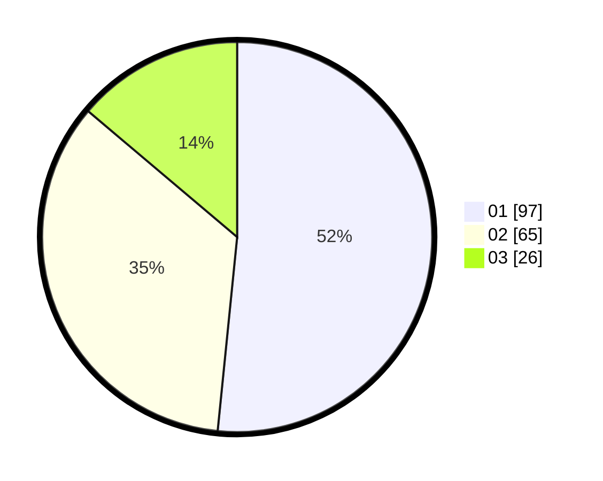

# Hasil

Hasil perolehan suara paslon dapat dilihat pada file paslon-01.txt, paslon-02.txt, dan paslon-03.txt.

Jika tidak ada, artinya data tersebut belum ada pada SIREKAP.

## Perolehan Suara

 * Paslon 01: **97**.
 * Paslon 02: **65**.
 * Paslon 03: **26**.

## Foto C Plano

https://sirekap-obj-formc.kpu.go.id/4de6/pemilu/ppwp/31/73/07/10/05/3173071005075-20240215-000040--3e72cad0-2949-42c7-b3ae-73c8845e6f87.jpg

https://sirekap-obj-formc.kpu.go.id/4de6/pemilu/ppwp/31/73/07/10/05/3173071005075-20240215-000321--36451e19-d6cf-409c-a14f-c379809f3c41.jpg

https://sirekap-obj-formc.kpu.go.id/4de6/pemilu/ppwp/31/73/07/10/05/3173071005075-20240215-000158--2c33591c-0da5-4a6b-b89c-59402381d833.jpg

## DATA PEMILIH TETAP

Jumlah pemilih dalam DPT: **266**.
 * L: **134**.
 * P: **132**.

## DATA PENGGUNA HAK PILIH

Jumlah pengguna hak pilih dalam DPT: **184**.
 * L: **90**.
 * P: **94**.

Jumlah pengguna hak pilih dalam DPTb: **6**.
 * L: **2**.
 * P: **4**.

Jumlah pengguna hak pilih dalam DPK: **1**.
 * L: **1**.
 * P: **0**.

Jumlah pengguna hak pilih: **191**.
 * L: **93**.
 * P: **98**.

## JUMLAH SUARA SAH DAN TIDAK SAH

JUMLAH SELURUH SUARA SAH: **188**.

JUMLAH SUARA TIDAK SAH: **3**.

JUMLAH SELURUH SUARA SAH DAN SUARA TIDAK SAH: **191**.
