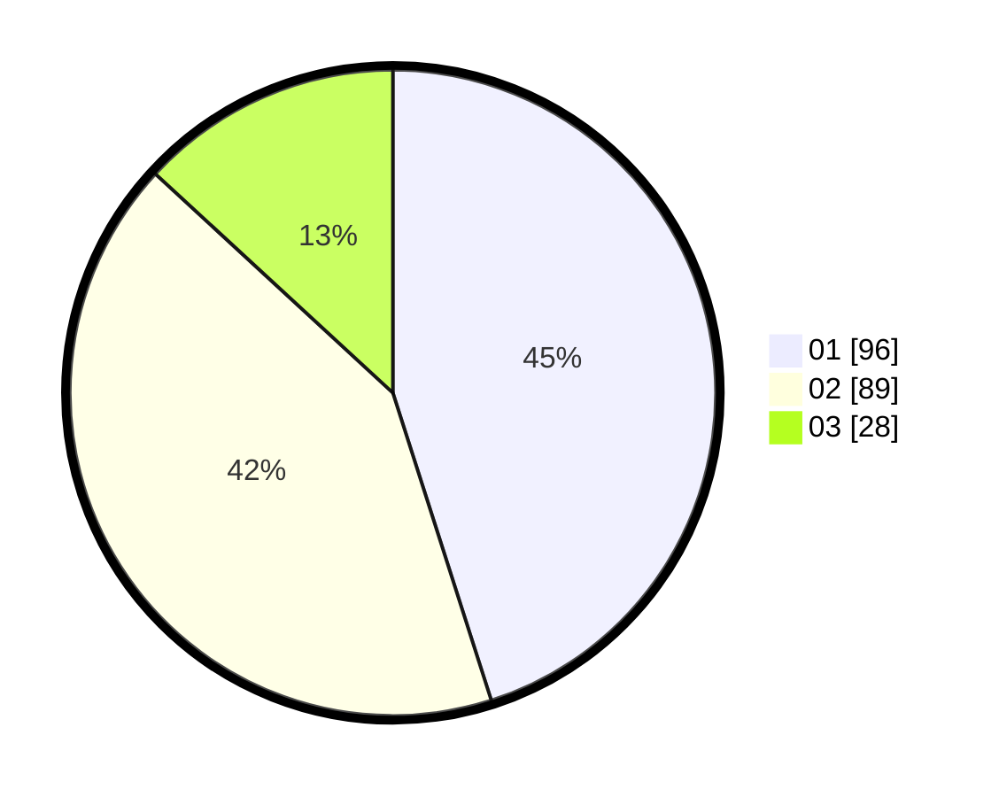

# Hasil

Hasil perolehan suara paslon dapat dilihat pada file paslon-01.txt, paslon-02.txt, dan paslon-03.txt.

Jika tidak ada, artinya data tersebut belum ada pada SIREKAP.

## Perolehan Suara

 * Paslon 01: **96**.
 * Paslon 02: **89**.
 * Paslon 03: **28**.

## Foto C Plano

https://sirekap-obj-formc.kpu.go.id/0eb3/pemilu/ppwp/31/73/07/10/05/3173071005077-20240214-155909--a479e96a-b36e-4b34-a9e0-ce29da223f07.jpg

https://sirekap-obj-formc.kpu.go.id/0eb3/pemilu/ppwp/31/73/07/10/05/3173071005077-20240215-015343--dff631ac-879a-457d-9912-8b428a89038d.jpg

https://sirekap-obj-formc.kpu.go.id/0eb3/pemilu/ppwp/31/73/07/10/05/3173071005077-20240215-015844--cd4dddea-191e-4818-81f5-ba999912b4e0.jpg

## DATA PEMILIH TETAP

Jumlah pemilih dalam DPT: **259**.
 * L: **129**.
 * P: **130**.

## DATA PENGGUNA HAK PILIH

Jumlah pengguna hak pilih dalam DPT: **209**.
 * L: **100**.
 * P: **109**.

Jumlah pengguna hak pilih dalam DPTb: **6**.
 * L: **3**.
 * P: **3**.

Jumlah pengguna hak pilih dalam DPK: **2**.
 * L: **2**.
 * P: **0**.

Jumlah pengguna hak pilih: **217**.
 * L: **105**.
 * P: **112**.

## JUMLAH SUARA SAH DAN TIDAK SAH

JUMLAH SELURUH SUARA SAH: **213**.

JUMLAH SUARA TIDAK SAH: **4**.

JUMLAH SELURUH SUARA SAH DAN SUARA TIDAK SAH: **217**.
