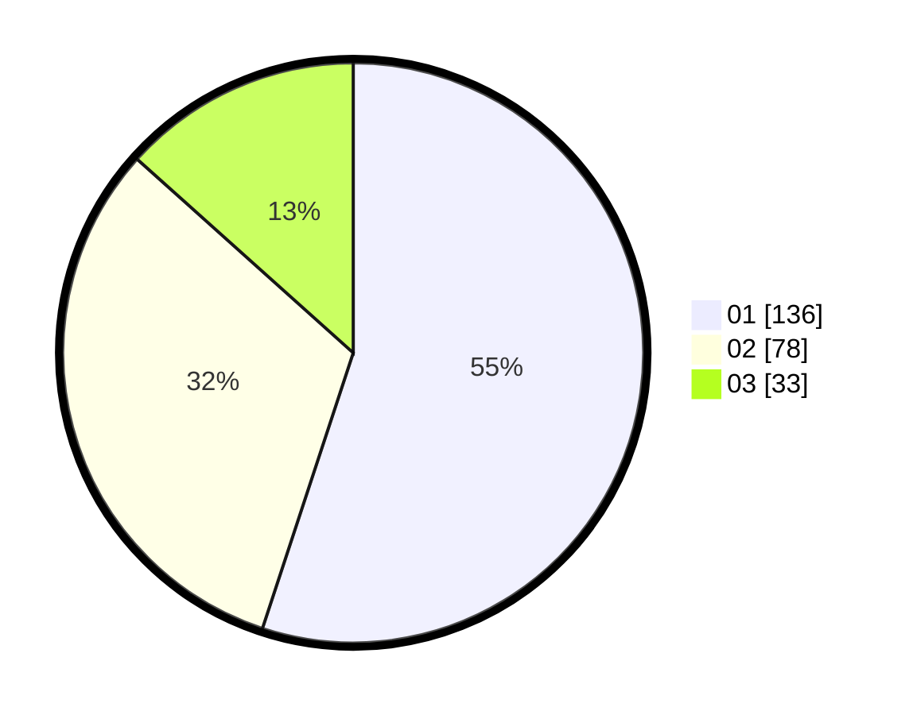

# Hasil

Hasil perolehan suara paslon dapat dilihat pada file paslon-01.txt, paslon-02.txt, dan paslon-03.txt.

Jika tidak ada, artinya data tersebut belum ada pada SIREKAP.

## Perolehan Suara

 * Paslon 01: **136**.
 * Paslon 02: **78**.
 * Paslon 03: **33**.

## Foto C Plano

https://sirekap-obj-formc.kpu.go.id/b9a2/pemilu/ppwp/31/73/07/10/05/3173071005085-20240214-194146--ed7c274d-e23b-4059-a3a9-ddbe697f9d6a.jpg

https://sirekap-obj-formc.kpu.go.id/b9a2/pemilu/ppwp/31/73/07/10/05/3173071005085-20240214-194433--004f7463-3ac7-496d-bd83-8c6962a3244e.jpg

https://sirekap-obj-formc.kpu.go.id/b9a2/pemilu/ppwp/31/73/07/10/05/3173071005085-20240214-194447--8f0e82c1-1a0a-4978-92ce-c44f447f5ccc.jpg

## DATA PEMILIH TETAP

Jumlah pemilih dalam DPT: **279**.
 * L: **137**.
 * P: **142**.

## DATA PENGGUNA HAK PILIH

Jumlah pengguna hak pilih dalam DPT: **232**.
 * L: **113**.
 * P: **119**.

Jumlah pengguna hak pilih dalam DPTb: **10**.
 * L: **6**.
 * P: **4**.

Jumlah pengguna hak pilih dalam DPK: **5**.
 * L: **2**.
 * P: **3**.

Jumlah pengguna hak pilih: **247**.
 * L: **121**.
 * P: **126**.

## JUMLAH SUARA SAH DAN TIDAK SAH

JUMLAH SELURUH SUARA SAH: **247**.

JUMLAH SUARA TIDAK SAH: **0**.

JUMLAH SELURUH SUARA SAH DAN SUARA TIDAK SAH: **247**.
