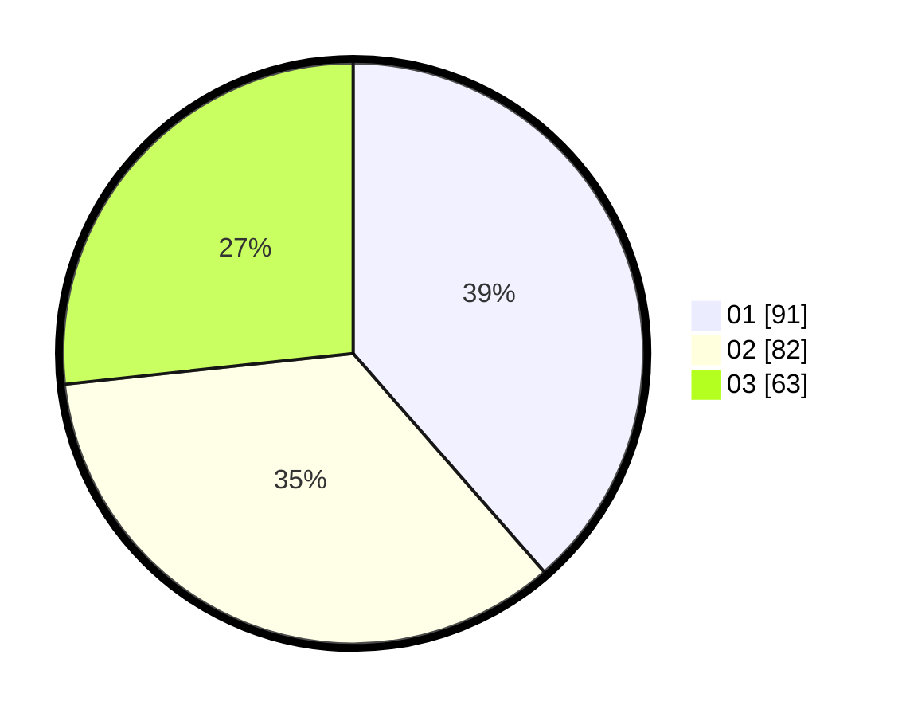

# Hasil

Hasil perolehan suara paslon dapat dilihat pada file paslon-01.txt, paslon-02.txt, dan paslon-03.txt.

Jika tidak ada, artinya data tersebut belum ada pada SIREKAP.

## Perolehan Suara

 * Paslon 01: **91**.
 * Paslon 02: **82**.
 * Paslon 03: **63**.

## Foto C Plano

https://sirekap-obj-formc.kpu.go.id/7ece/pemilu/ppwp/31/73/07/10/05/3173071005088-20240215-012034--7e014a4b-d70c-410d-8b5e-1733a274044f.jpg

https://sirekap-obj-formc.kpu.go.id/7ece/pemilu/ppwp/31/73/07/10/05/3173071005088-20240215-012117--2a97451a-55c1-4427-8ce9-53be79e67af6.jpg

https://sirekap-obj-formc.kpu.go.id/7ece/pemilu/ppwp/31/73/07/10/05/3173071005088-20240215-012302--53004db8-9698-4e24-abe2-11f67260157f.jpg
