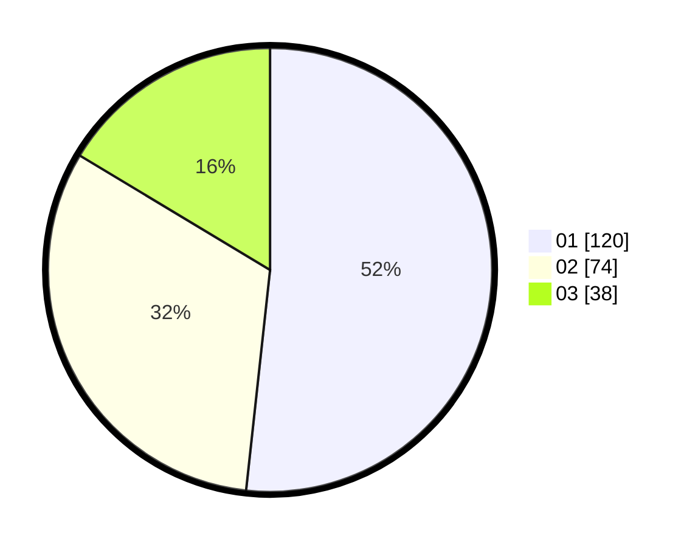

# Hasil

Hasil perolehan suara paslon dapat dilihat pada file paslon-01.txt, paslon-02.txt, dan paslon-03.txt.

Jika tidak ada, artinya data tersebut belum ada pada SIREKAP.

## Perolehan Suara

 * Paslon 01: **120**.
 * Paslon 02: **74**.
 * Paslon 03: **38**.

## Foto C Plano

https://sirekap-obj-formc.kpu.go.id/8ec6/pemilu/ppwp/31/73/07/10/05/3173071005090-20240214-223621--e7859474-3db5-4188-9d11-8c7a0445bd4b.jpg

https://sirekap-obj-formc.kpu.go.id/8ec6/pemilu/ppwp/31/73/07/10/05/3173071005090-20240214-223907--a29779b9-3a57-48d0-854f-0051310d37d1.jpg

https://sirekap-obj-formc.kpu.go.id/8ec6/pemilu/ppwp/31/73/07/10/05/3173071005090-20240214-224053--e692fbe4-44eb-40a0-87fa-775bc9956e29.jpg
