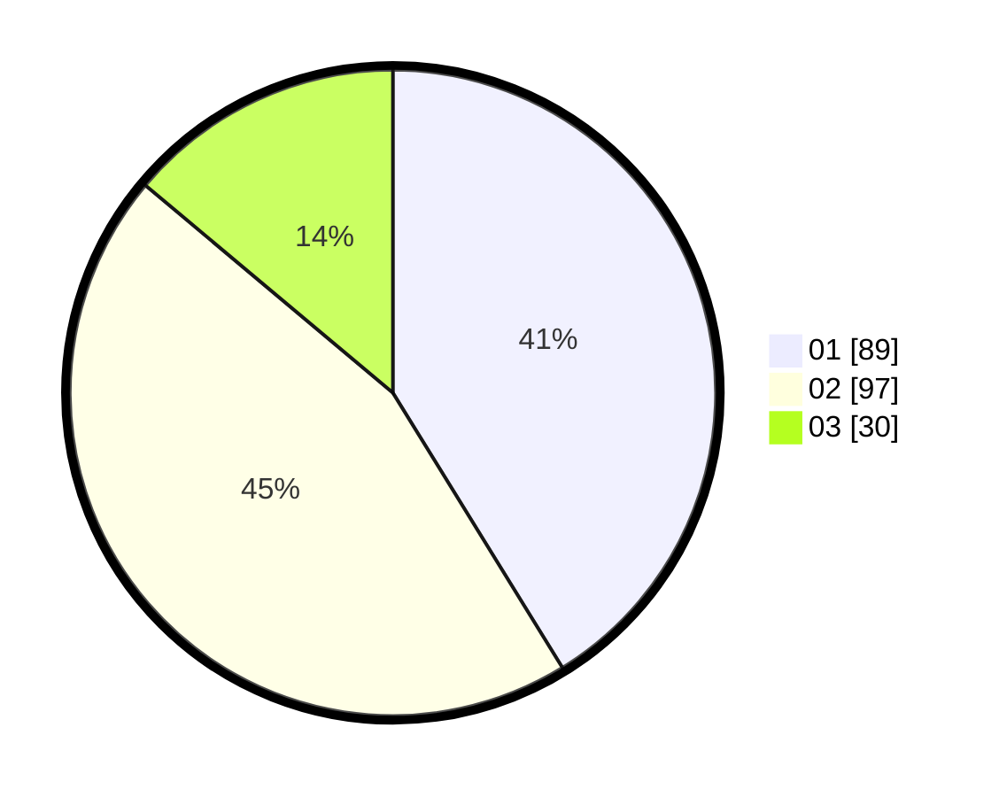

# Hasil

Hasil perolehan suara paslon dapat dilihat pada file paslon-01.txt, paslon-02.txt, dan paslon-03.txt.

Jika tidak ada, artinya data tersebut belum ada pada SIREKAP.

## Perolehan Suara

 * Paslon 01: **89**.
 * Paslon 02: **97**.
 * Paslon 03: **30**.

## Foto C Plano

https://sirekap-obj-formc.kpu.go.id/9af6/pemilu/ppwp/31/73/07/10/05/3173071005092-20240214-231742--14ba5877-34e2-472e-9e56-2026b44f8361.jpg

https://sirekap-obj-formc.kpu.go.id/9af6/pemilu/ppwp/31/73/07/10/05/3173071005092-20240214-231859--c6e0ee61-b697-43b5-86aa-51a9f86b9d80.jpg

https://sirekap-obj-formc.kpu.go.id/9af6/pemilu/ppwp/31/73/07/10/05/3173071005092-20240214-231929--4b0e5ec5-7ed4-4774-99ad-26e5d4d5de9e.jpg
