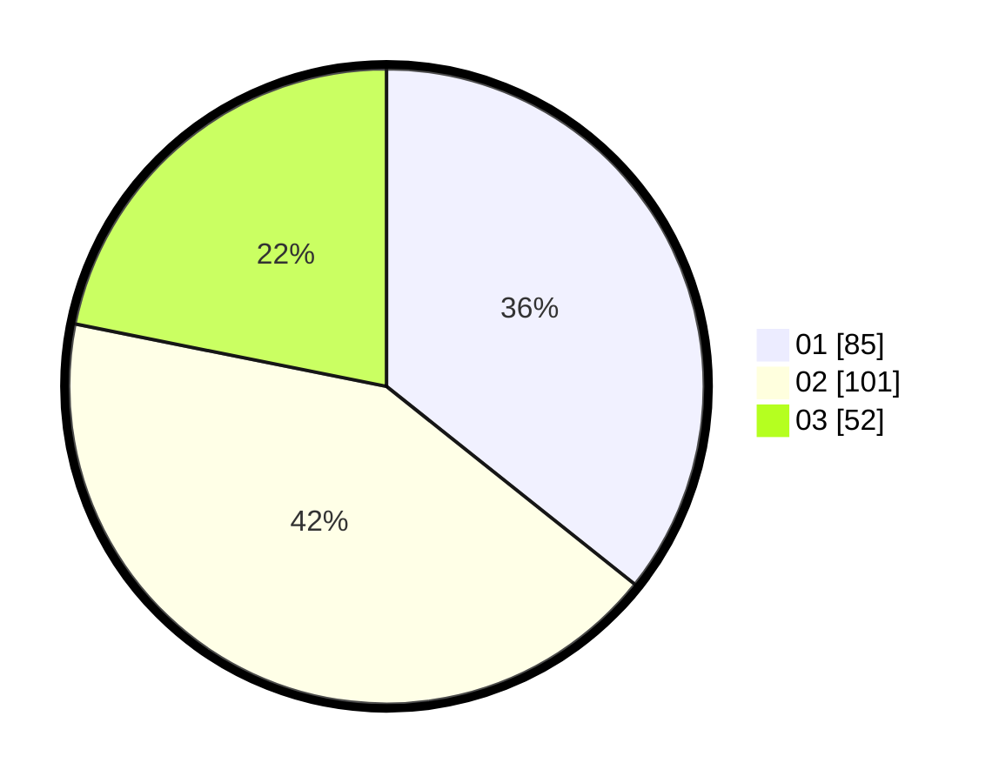

# Hasil

Hasil perolehan suara paslon dapat dilihat pada file paslon-01.txt, paslon-02.txt, dan paslon-03.txt.

Jika tidak ada, artinya data tersebut belum ada pada SIREKAP.

## Perolehan Suara

 * Paslon 01: **85**.
 * Paslon 02: **101**.
 * Paslon 03: **52**.

## Foto C Plano

https://sirekap-obj-formc.kpu.go.id/77d9/pemilu/ppwp/31/73/07/10/05/3173071005093-20240216-215106--3d8823b7-8d1e-4f35-ac09-3da3f6e1a92f.jpg

https://sirekap-obj-formc.kpu.go.id/77d9/pemilu/ppwp/31/73/07/10/05/3173071005093-20240215-004916--b4799b07-67a8-433d-8c3d-7f84bbc7d902.jpg

https://sirekap-obj-formc.kpu.go.id/77d9/pemilu/ppwp/31/73/07/10/05/3173071005093-20240215-004909--4c7e9fdf-bee4-4c4c-b039-34b87486f308.jpg
