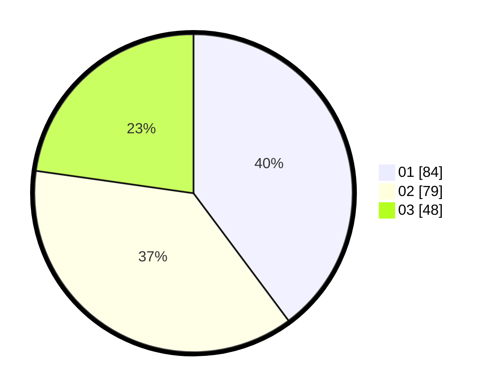

# Hasil

Hasil perolehan suara paslon dapat dilihat pada file paslon-01.txt, paslon-02.txt, dan paslon-03.txt.

Jika tidak ada, artinya data tersebut belum ada pada SIREKAP.

## Perolehan Suara

 * Paslon 01: **84**.
 * Paslon 02: **79**.
 * Paslon 03: **48**.

## Foto C Plano

https://sirekap-obj-formc.kpu.go.id/ffb9/pemilu/ppwp/31/73/07/10/05/3173071005095-20240214-204130--28e6475d-a80c-410e-b3c6-e4e9a8bc4236.jpg

https://sirekap-obj-formc.kpu.go.id/ffb9/pemilu/ppwp/31/73/07/10/05/3173071005095-20240214-204146--e2c8ed42-b6bf-4300-9f87-a67d0133579c.jpg

https://sirekap-obj-formc.kpu.go.id/ffb9/pemilu/ppwp/31/73/07/10/05/3173071005095-20240214-204153--41aff1d5-13e2-4cdd-986c-3d5aa3ac7c04.jpg
