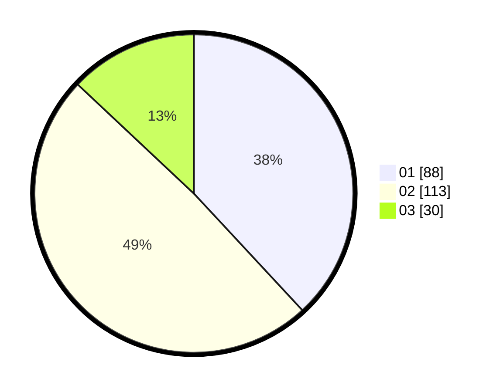

# Hasil

Hasil perolehan suara paslon dapat dilihat pada file paslon-01.txt, paslon-02.txt, dan paslon-03.txt.

Jika tidak ada, artinya data tersebut belum ada pada SIREKAP.

## Perolehan Suara

 * Paslon 01: **88**.
 * Paslon 02: **113**.
 * Paslon 03: **30**.

## Foto C Plano

https://sirekap-obj-formc.kpu.go.id/4c9e/pemilu/ppwp/31/73/07/10/05/3173071005098-20240214-212934--ece12dab-4f4f-43fc-80d8-c7467b88eed3.jpg

https://sirekap-obj-formc.kpu.go.id/4c9e/pemilu/ppwp/31/73/07/10/05/3173071005098-20240214-213108--4f01c67c-4a4f-44c7-9604-eca95656d67f.jpg

https://sirekap-obj-formc.kpu.go.id/4c9e/pemilu/ppwp/31/73/07/10/05/3173071005098-20240214-213230--a7cf5752-8664-4b50-bc75-5e9d6da151c0.jpg
