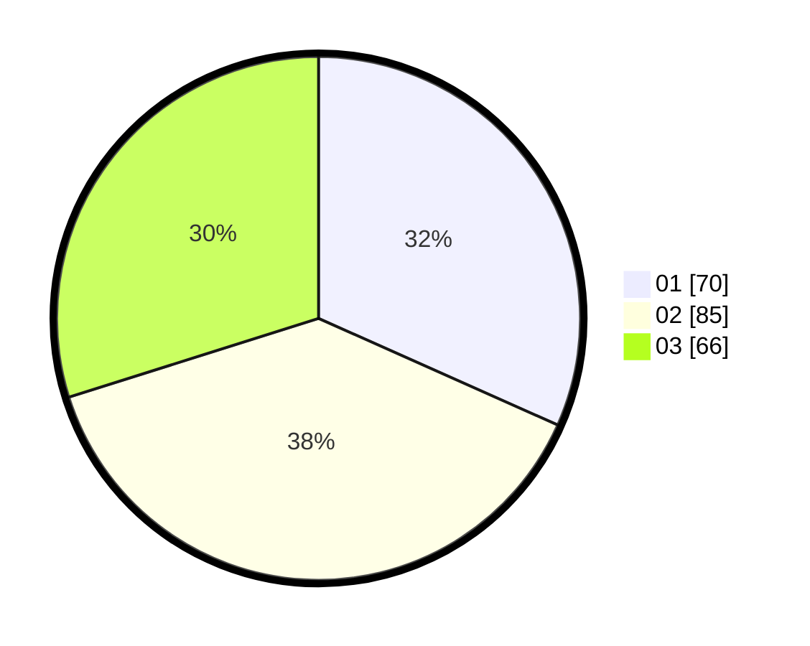

# Hasil

Hasil perolehan suara paslon dapat dilihat pada file paslon-01.txt, paslon-02.txt, dan paslon-03.txt.

Jika tidak ada, artinya data tersebut belum ada pada SIREKAP.

## Perolehan Suara

 * Paslon 01: **70**.
 * Paslon 02: **85**.
 * Paslon 03: **66**.

## Foto C Plano

https://sirekap-obj-formc.kpu.go.id/e026/pemilu/ppwp/31/73/07/10/05/3173071005101-20240214-220340--4615add2-059d-454a-b757-622761c5b9bf.jpg

https://sirekap-obj-formc.kpu.go.id/e026/pemilu/ppwp/31/73/07/10/05/3173071005101-20240214-220618--c5ac1854-96e4-458a-b0a6-afe5ca1eaae6.jpg

https://sirekap-obj-formc.kpu.go.id/e026/pemilu/ppwp/31/73/07/10/05/3173071005101-20240214-220819--e6d8c8bd-055b-4b2b-bb79-76274047ca1f.jpg
