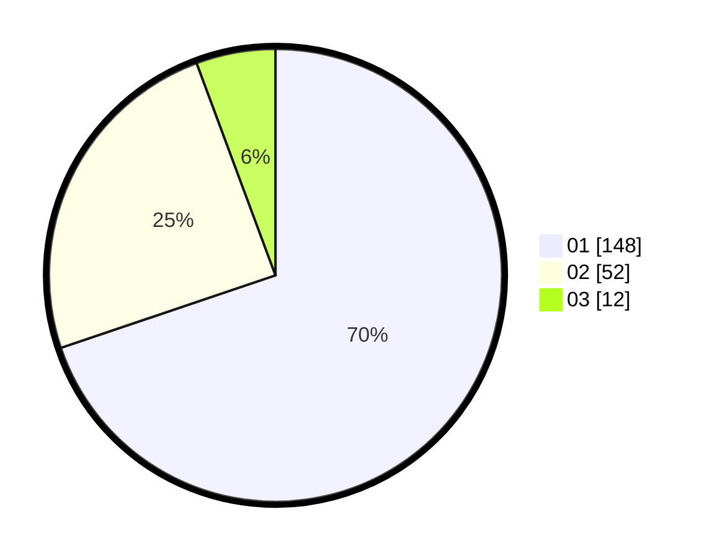

# Hasil

Hasil perolehan suara paslon dapat dilihat pada file paslon-01.txt, paslon-02.txt, dan paslon-03.txt.

Jika tidak ada, artinya data tersebut belum ada pada SIREKAP.

## Perolehan Suara

 * Paslon 01: **148**.
 * Paslon 02: **52**.
 * Paslon 03: **12**.

## Foto C Plano

https://sirekap-obj-formc.kpu.go.id/56ca/pemilu/ppwp/31/73/07/10/05/3173071005105-20240214-155831--da5b109a-e71c-4e01-80fe-c0cc2279c059.jpg

https://sirekap-obj-formc.kpu.go.id/56ca/pemilu/ppwp/31/73/07/10/05/3173071005105-20240214-155720--59ca27d5-e4cf-4975-afaf-5e8a8e2b70be.jpg

https://sirekap-obj-formc.kpu.go.id/56ca/pemilu/ppwp/31/73/07/10/05/3173071005105-20240214-160106--c35823bf-292e-4d7d-a39c-ec2e4f2bb74f.jpg

## DATA PEMILIH TETAP

Jumlah pemilih dalam DPT: **251**.
 * L: **120**.
 * P: **131**.

## DATA PENGGUNA HAK PILIH

Jumlah pengguna hak pilih dalam DPT: **209**.
 * L: **102**.
 * P: **107**.

Jumlah pengguna hak pilih dalam DPTb: **6**.
 * L: **3**.
 * P: **3**.

Jumlah pengguna hak pilih dalam DPK: **4**.
 * L: **1**.
 * P: **3**.

Jumlah pengguna hak pilih: **219**.
 * L: **106**.
 * P: **113**.

## JUMLAH SUARA SAH DAN TIDAK SAH

JUMLAH SELURUH SUARA SAH: **212**.

JUMLAH SUARA TIDAK SAH: **7**.

JUMLAH SELURUH SUARA SAH DAN SUARA TIDAK SAH: **219**.
