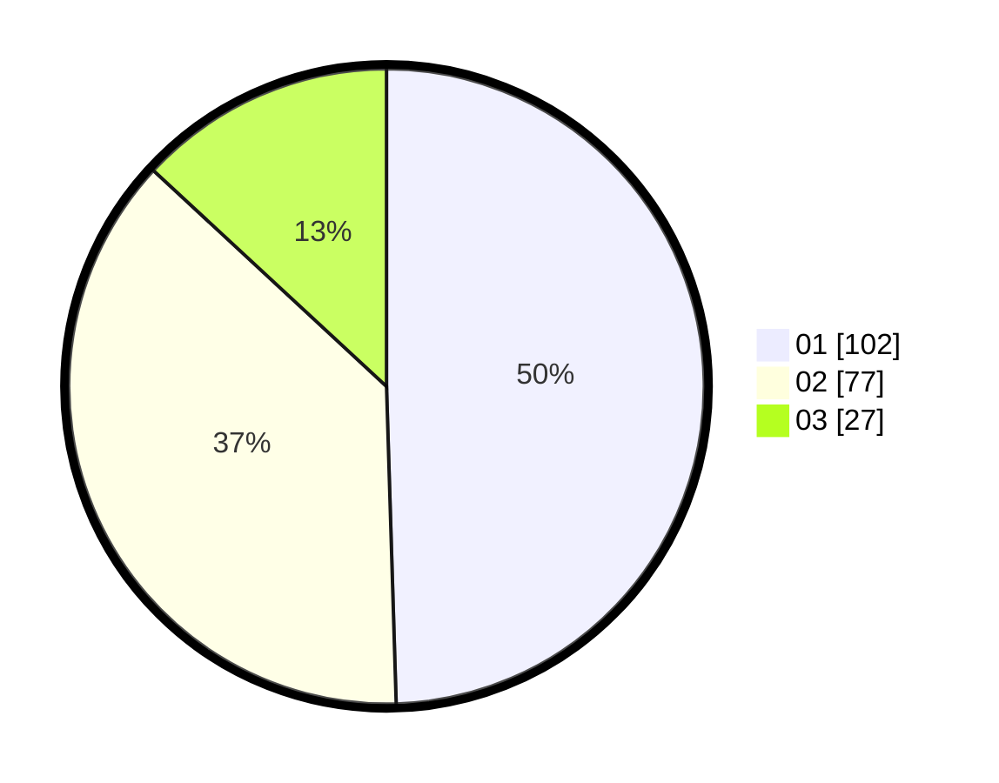

# Hasil

Hasil perolehan suara paslon dapat dilihat pada file paslon-01.txt, paslon-02.txt, dan paslon-03.txt.

Jika tidak ada, artinya data tersebut belum ada pada SIREKAP.

## Perolehan Suara

 * Paslon 01: **102**.
 * Paslon 02: **77**.
 * Paslon 03: **27**.

## Foto C Plano

https://sirekap-obj-formc.kpu.go.id/02f7/pemilu/ppwp/31/73/07/10/05/3173071005107-20240214-155042--ba2a7fc9-3b69-4cfa-a3b8-a282457070c5.jpg

https://sirekap-obj-formc.kpu.go.id/02f7/pemilu/ppwp/31/73/07/10/05/3173071005107-20240214-155037--cf721a6f-4da4-4276-9131-38754a76654d.jpg

https://sirekap-obj-formc.kpu.go.id/02f7/pemilu/ppwp/31/73/07/10/05/3173071005107-20240214-155029--b04d2c5c-732f-46fb-97d2-86591acb9db5.jpg

## DATA PEMILIH TETAP

Jumlah pemilih dalam DPT: **253**.
 * L: **130**.
 * P: **123**.

## DATA PENGGUNA HAK PILIH

Jumlah pengguna hak pilih dalam DPT: **204**.
 * L: **102**.
 * P: **102**.

Jumlah pengguna hak pilih dalam DPTb: **6**.
 * L: **1**.
 * P: **5**.

Jumlah pengguna hak pilih dalam DPK: **0**.
 * L: **0**.
 * P: **0**.

Jumlah pengguna hak pilih: **210**.
 * L: **103**.
 * P: **107**.

## JUMLAH SUARA SAH DAN TIDAK SAH

JUMLAH SELURUH SUARA SAH: **206**.

JUMLAH SUARA TIDAK SAH: **4**.

JUMLAH SELURUH SUARA SAH DAN SUARA TIDAK SAH: **210**.
