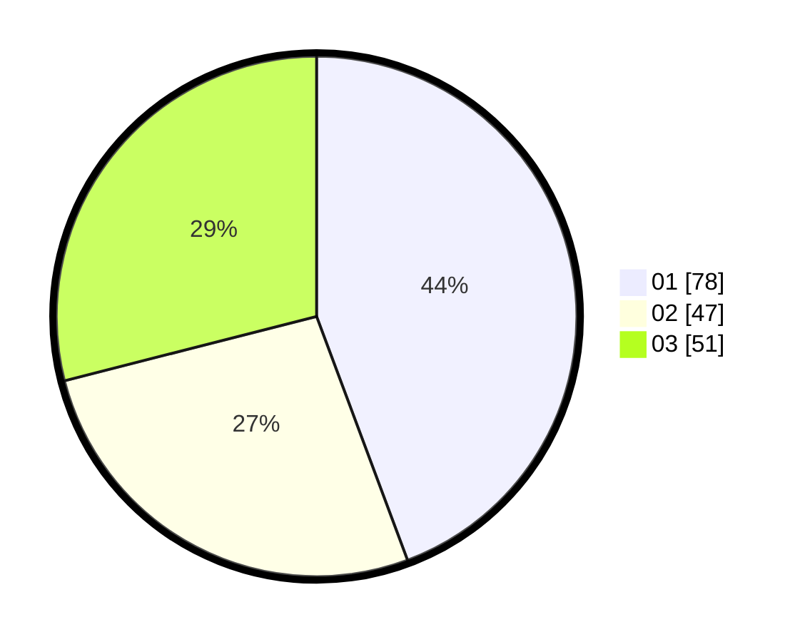

# Hasil

Hasil perolehan suara paslon dapat dilihat pada file paslon-01.txt, paslon-02.txt, dan paslon-03.txt.

Jika tidak ada, artinya data tersebut belum ada pada SIREKAP.

## Perolehan Suara

 * Paslon 01: **78**.
 * Paslon 02: **47**.
 * Paslon 03: **51**.

## Foto C Plano

https://sirekap-obj-formc.kpu.go.id/93a0/pemilu/ppwp/31/73/07/10/05/3173071005109-20240215-013240--1d220f68-aa94-4475-b7c7-d995e55fd59b.jpg

https://sirekap-obj-formc.kpu.go.id/93a0/pemilu/ppwp/31/73/07/10/05/3173071005109-20240214-233811--1e66c3da-ffd7-4528-a860-3bd15b14f41c.jpg

https://sirekap-obj-formc.kpu.go.id/93a0/pemilu/ppwp/31/73/07/10/05/3173071005109-20240215-013531--d88a5b4f-ab4f-47c4-90ef-e7d193fad27b.jpg

## DATA PEMILIH TETAP

Jumlah pemilih dalam DPT: **215**.
 * L: **103**.
 * P: **112**.

## DATA PENGGUNA HAK PILIH

Jumlah pengguna hak pilih dalam DPT: **157**.
 * L: **68**.
 * P: **89**.

Jumlah pengguna hak pilih dalam DPTb: **16**.
 * L: **7**.
 * P: **9**.

Jumlah pengguna hak pilih dalam DPK: **8**.
 * L: **4**.
 * P: **4**.

Jumlah pengguna hak pilih: **181**.
 * L: **79**.
 * P: **102**.

## JUMLAH SUARA SAH DAN TIDAK SAH

JUMLAH SELURUH SUARA SAH: **176**.

JUMLAH SUARA TIDAK SAH: **5**.

JUMLAH SELURUH SUARA SAH DAN SUARA TIDAK SAH: **181**.
