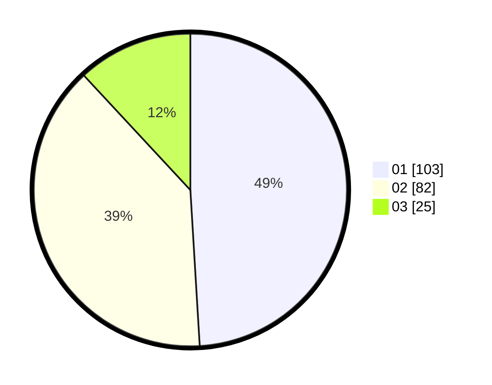

# Hasil

Hasil perolehan suara paslon dapat dilihat pada file paslon-01.txt, paslon-02.txt, dan paslon-03.txt.

Jika tidak ada, artinya data tersebut belum ada pada SIREKAP.

## Perolehan Suara

 * Paslon 01: **103**.
 * Paslon 02: **82**.
 * Paslon 03: **25**.

## Foto C Plano

https://sirekap-obj-formc.kpu.go.id/ac8f/pemilu/ppwp/31/73/07/10/06/3173071006001-20240216-130427--5c776186-1448-44f6-bd8f-d1dfaa90e960.jpg

https://sirekap-obj-formc.kpu.go.id/ac8f/pemilu/ppwp/31/73/07/10/06/3173071006001-20240216-130429--952352b0-2c68-4558-8bc7-371a49a6e293.jpg

https://sirekap-obj-formc.kpu.go.id/ac8f/pemilu/ppwp/31/73/07/10/06/3173071006001-20240216-130428--0d22ee59-db00-4ee5-8d8c-050fc92918c8.jpg

## DATA PEMILIH TETAP

Jumlah pemilih dalam DPT: **269**.
 * L: **138**.
 * P: **131**.

## DATA PENGGUNA HAK PILIH

Jumlah pengguna hak pilih dalam DPT: **209**.
 * L: **102**.
 * P: **107**.

Jumlah pengguna hak pilih dalam DPTb: **2**.
 * L: **2**.
 * P: **0**.

Jumlah pengguna hak pilih dalam DPK: **0**.
 * L: **0**.
 * P: **0**.

Jumlah pengguna hak pilih: **212**.
 * L: **104**.
 * P: **108**.

## JUMLAH SUARA SAH DAN TIDAK SAH

JUMLAH SELURUH SUARA SAH: **210**.

JUMLAH SUARA TIDAK SAH: **2**.

JUMLAH SELURUH SUARA SAH DAN SUARA TIDAK SAH: **212**.
