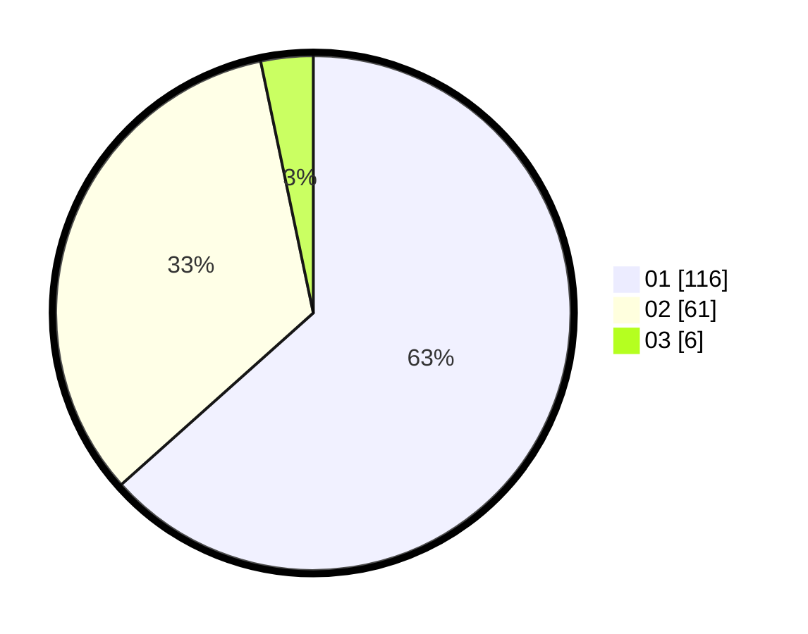

# Hasil

Hasil perolehan suara paslon dapat dilihat pada file paslon-01.txt, paslon-02.txt, dan paslon-03.txt.

Jika tidak ada, artinya data tersebut belum ada pada SIREKAP.

## Perolehan Suara

 * Paslon 01: **116**.
 * Paslon 02: **61**.
 * Paslon 03: **6**.

## Foto C Plano

https://sirekap-obj-formc.kpu.go.id/3e38/pemilu/ppwp/31/73/07/10/06/3173071006007-20240214-220356--4b190678-1e44-429c-9642-6270e018564b.jpg

https://sirekap-obj-formc.kpu.go.id/3e38/pemilu/ppwp/31/73/07/10/06/3173071006007-20240214-220518--573ab7e6-9647-4568-ad3b-ea0960fd6f83.jpg

https://sirekap-obj-formc.kpu.go.id/3e38/pemilu/ppwp/31/73/07/10/06/3173071006007-20240214-220631--5c9df950-bce1-4799-a4e3-82b424e058ac.jpg
