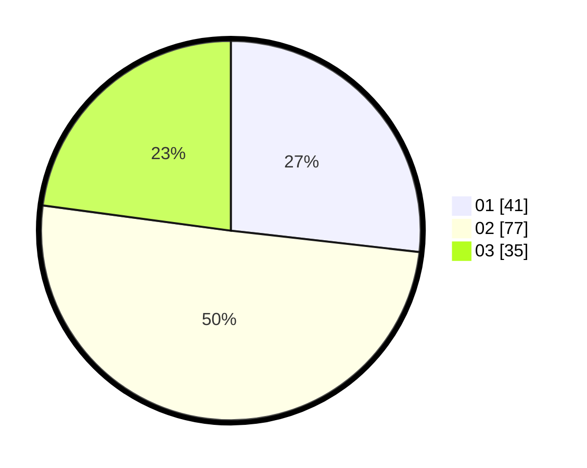

# Hasil

Hasil perolehan suara paslon dapat dilihat pada file paslon-01.txt, paslon-02.txt, dan paslon-03.txt.

Jika tidak ada, artinya data tersebut belum ada pada SIREKAP.

## Perolehan Suara

 * Paslon 01: **41**.
 * Paslon 02: **77**.
 * Paslon 03: **35**.

## Foto C Plano

https://sirekap-obj-formc.kpu.go.id/661d/pemilu/ppwp/31/73/07/10/06/3173071006008-20240214-195314--f0f62ac0-478c-4d1c-b9d7-7b8792ec147f.jpg

https://sirekap-obj-formc.kpu.go.id/661d/pemilu/ppwp/31/73/07/10/06/3173071006008-20240214-193758--ec9e453d-afcd-4067-9bee-959f05d3bab0.jpg

https://sirekap-obj-formc.kpu.go.id/661d/pemilu/ppwp/31/73/07/10/06/3173071006008-20240214-195727--b9665d71-ad94-4855-b9cc-00e6e4cb0acd.jpg

## DATA PEMILIH TETAP

Jumlah pemilih dalam DPT: **207**.
 * L: **97**.
 * P: **110**.

## DATA PENGGUNA HAK PILIH

Jumlah pengguna hak pilih dalam DPT: **146**.
 * L: **61**.
 * P: **85**.

Jumlah pengguna hak pilih dalam DPTb: **6**.
 * L: **0**.
 * P: **6**.

Jumlah pengguna hak pilih dalam DPK: **1**.
 * L: **0**.
 * P: **1**.

Jumlah pengguna hak pilih: **153**.
 * L: **61**.
 * P: **92**.

## JUMLAH SUARA SAH DAN TIDAK SAH

JUMLAH SELURUH SUARA SAH: **153**.

JUMLAH SUARA TIDAK SAH: **0**.

JUMLAH SELURUH SUARA SAH DAN SUARA TIDAK SAH: **153**.
