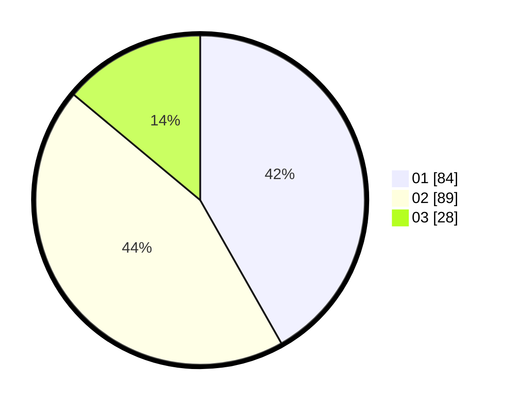

# Hasil

Hasil perolehan suara paslon dapat dilihat pada file paslon-01.txt, paslon-02.txt, dan paslon-03.txt.

Jika tidak ada, artinya data tersebut belum ada pada SIREKAP.

## Perolehan Suara

 * Paslon 01: **84**.
 * Paslon 02: **89**.
 * Paslon 03: **28**.

## Foto C Plano

https://sirekap-obj-formc.kpu.go.id/2031/pemilu/ppwp/31/73/07/10/06/3173071006009-20240215-023800--f6b28690-c9fa-4cce-8695-e27fcc664bfe.jpg

https://sirekap-obj-formc.kpu.go.id/2031/pemilu/ppwp/31/73/07/10/06/3173071006009-20240215-025944--9bdff246-35c1-452a-929f-478e9c69c9e3.jpg

https://sirekap-obj-formc.kpu.go.id/2031/pemilu/ppwp/31/73/07/10/06/3173071006009-20240215-030036--924929e3-9465-47c5-9eee-06f6df908029.jpg
