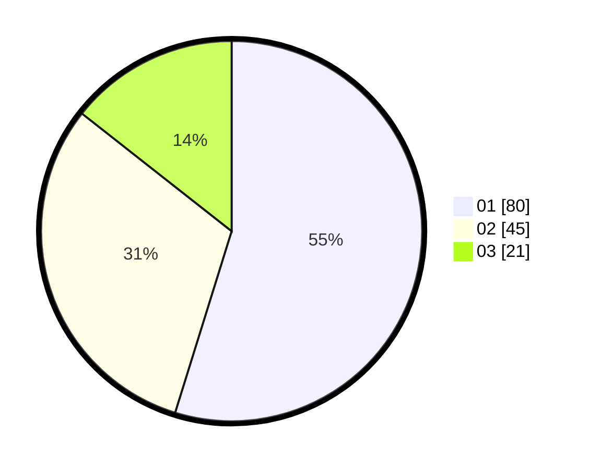

# Hasil

Hasil perolehan suara paslon dapat dilihat pada file paslon-01.txt, paslon-02.txt, dan paslon-03.txt.

Jika tidak ada, artinya data tersebut belum ada pada SIREKAP.

## Perolehan Suara

 * Paslon 01: **80**.
 * Paslon 02: **45**.
 * Paslon 03: **21**.

## Foto C Plano

https://sirekap-obj-formc.kpu.go.id/891b/pemilu/ppwp/31/73/07/10/06/3173071006013-20240214-191742--5c9a8fa9-3b83-4ffa-a5ea-ea835edea2a9.jpg

https://sirekap-obj-formc.kpu.go.id/891b/pemilu/ppwp/31/73/07/10/06/3173071006013-20240214-191747--a4bbf607-4375-425a-b44d-afa842bb2863.jpg

https://sirekap-obj-formc.kpu.go.id/891b/pemilu/ppwp/31/73/07/10/06/3173071006013-20240214-191751--bc9860d0-7289-49b7-8e15-ed171dc09885.jpg

## DATA PEMILIH TETAP

Jumlah pemilih dalam DPT: **210**.
 * L: **113**.
 * P: **97**.

## DATA PENGGUNA HAK PILIH

Jumlah pengguna hak pilih dalam DPT: **148**.
 * L: **69**.
 * P: **79**.

Jumlah pengguna hak pilih dalam DPTb: **1**.
 * L: **1**.
 * P: **0**.

Jumlah pengguna hak pilih dalam DPK: **2**.
 * L: **1**.
 * P: **1**.

Jumlah pengguna hak pilih: **151**.
 * L: **71**.
 * P: **80**.

## JUMLAH SUARA SAH DAN TIDAK SAH

JUMLAH SELURUH SUARA SAH: **146**.

JUMLAH SUARA TIDAK SAH: **5**.

JUMLAH SELURUH SUARA SAH DAN SUARA TIDAK SAH: **151**.
