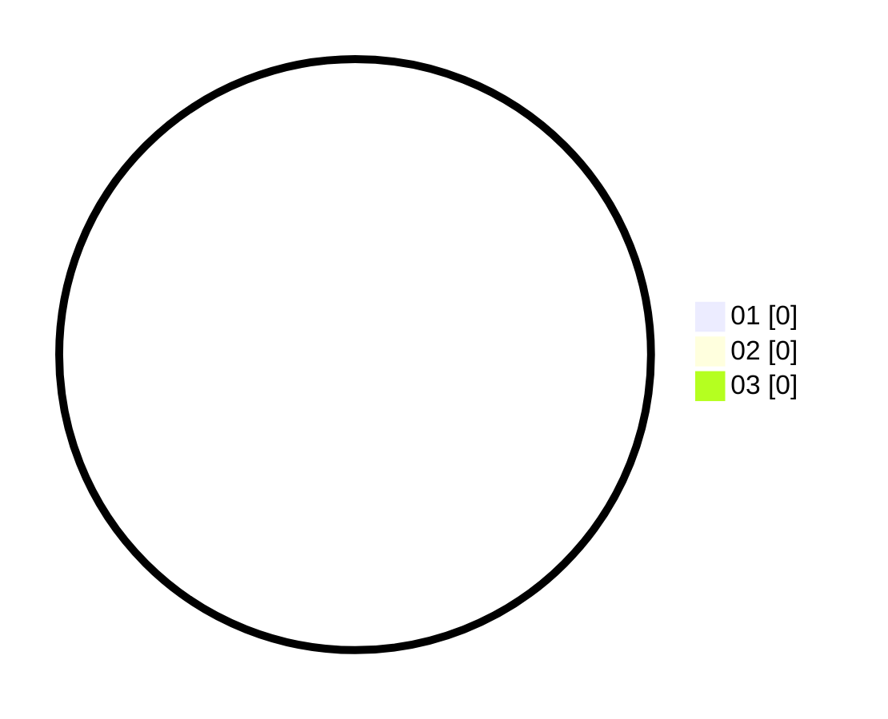

# Hasil

Hasil perolehan suara paslon dapat dilihat pada file paslon-01.txt, paslon-02.txt, dan paslon-03.txt.

Jika tidak ada, artinya data tersebut belum ada pada SIREKAP.

## Perolehan Suara

 * Paslon 01: **0**.
 * Paslon 02: **0**.
 * Paslon 03: **0**.

## Foto C Plano

https://sirekap-obj-formc.kpu.go.id/4727/pemilu/ppwp/31/73/07/10/06/3173071006015-20240214-225824--fc279439-4407-43c6-9146-9373eb504747.jpg

https://sirekap-obj-formc.kpu.go.id/4727/pemilu/ppwp/31/73/07/10/06/3173071006015-20240215-005650--027e6a92-0e7f-4de8-a14f-59ec2dc691fb.jpg

https://sirekap-obj-formc.kpu.go.id/4727/pemilu/ppwp/31/73/07/10/06/3173071006015-20240215-005727--e20a6e06-553d-4651-ba5d-28a9b964329e.jpg
