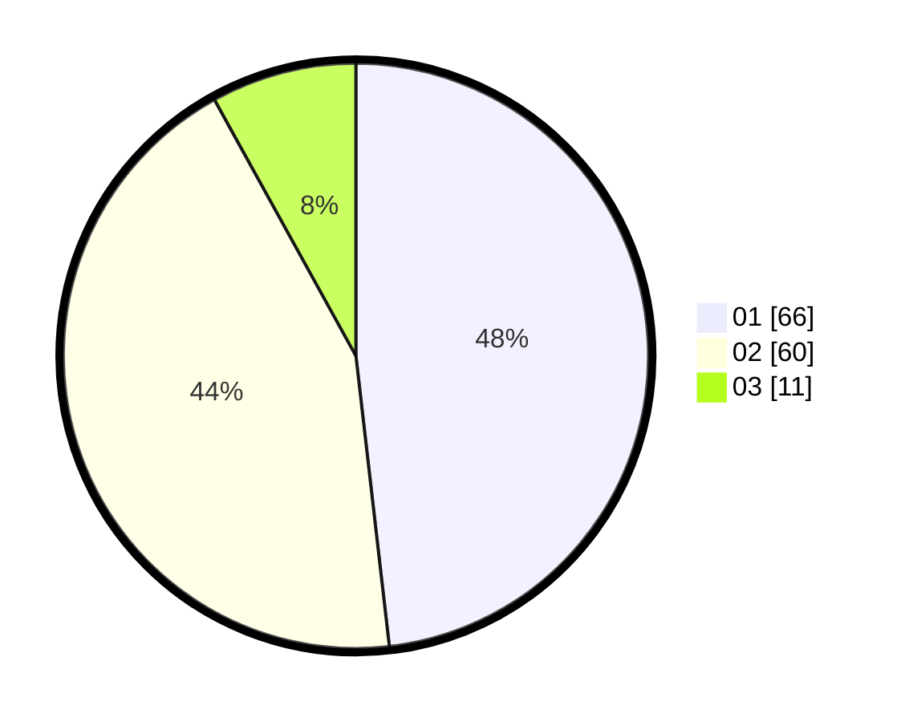

# Hasil

Hasil perolehan suara paslon dapat dilihat pada file paslon-01.txt, paslon-02.txt, dan paslon-03.txt.

Jika tidak ada, artinya data tersebut belum ada pada SIREKAP.

## Perolehan Suara

 * Paslon 01: **66**.
 * Paslon 02: **60**.
 * Paslon 03: **11**.

## Foto C Plano

https://sirekap-obj-formc.kpu.go.id/35fa/pemilu/ppwp/31/73/07/10/06/3173071006019-20240214-214028--8b6e7648-5ddb-4464-b072-54f57367ffe4.jpg

https://sirekap-obj-formc.kpu.go.id/35fa/pemilu/ppwp/31/73/07/10/06/3173071006019-20240214-214252--3c92728d-9d43-410d-a8b0-375c126690e4.jpg

https://sirekap-obj-formc.kpu.go.id/35fa/pemilu/ppwp/31/73/07/10/06/3173071006019-20240214-214432--441021cd-4c3e-4706-8370-5ac33eb28371.jpg
