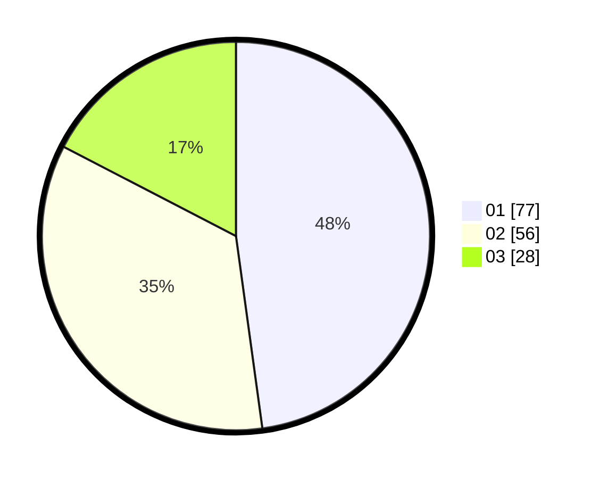

# Hasil

Hasil perolehan suara paslon dapat dilihat pada file paslon-01.txt, paslon-02.txt, dan paslon-03.txt.

Jika tidak ada, artinya data tersebut belum ada pada SIREKAP.

## Perolehan Suara

 * Paslon 01: **77**.
 * Paslon 02: **56**.
 * Paslon 03: **28**.

## Foto C Plano

https://sirekap-obj-formc.kpu.go.id/287f/pemilu/ppwp/31/73/07/10/06/3173071006021-20240216-034110--606ce59c-8af2-49fa-add0-c8c456a1b598.jpg

https://sirekap-obj-formc.kpu.go.id/287f/pemilu/ppwp/31/73/07/10/06/3173071006021-20240216-034112--0524b919-0611-4811-b796-aba6ca387719.jpg

https://sirekap-obj-formc.kpu.go.id/287f/pemilu/ppwp/31/73/07/10/06/3173071006021-20240216-034111--fa022e58-dc43-4adc-b46a-c6f8034348d1.jpg

## DATA PEMILIH TETAP

Jumlah pemilih dalam DPT: **0**.
 * L: **0**.
 * P: **0**.

## DATA PENGGUNA HAK PILIH

Jumlah pengguna hak pilih dalam DPT: **0**.
 * L: **0**.
 * P: **0**.

Jumlah pengguna hak pilih dalam DPTb: **0**.
 * L: **0**.
 * P: **0**.

Jumlah pengguna hak pilih dalam DPK: **0**.
 * L: **0**.
 * P: **0**.

Jumlah pengguna hak pilih: **0**.
 * L: **0**.
 * P: **0**.

## JUMLAH SUARA SAH DAN TIDAK SAH

JUMLAH SELURUH SUARA SAH: **161**.

JUMLAH SUARA TIDAK SAH: **5**.

JUMLAH SELURUH SUARA SAH DAN SUARA TIDAK SAH: **166**.
