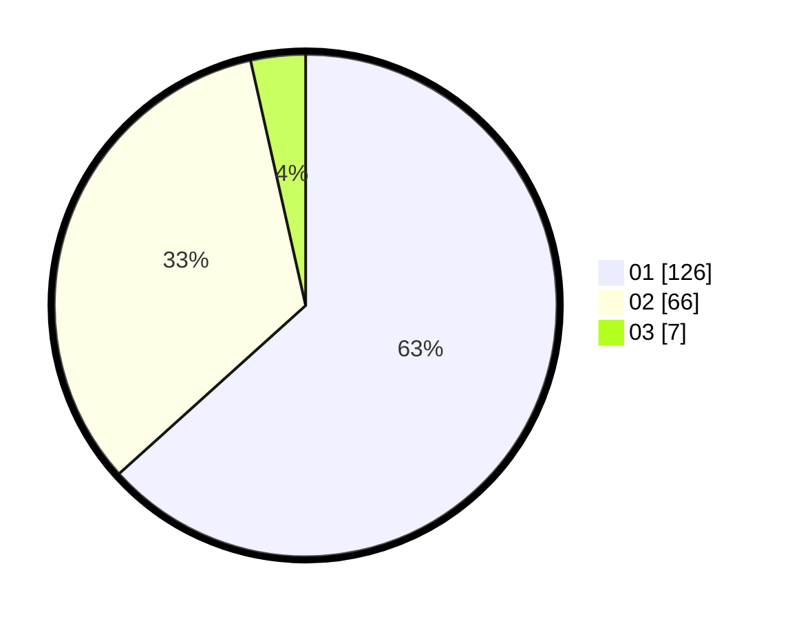

# Hasil

Hasil perolehan suara paslon dapat dilihat pada file paslon-01.txt, paslon-02.txt, dan paslon-03.txt.

Jika tidak ada, artinya data tersebut belum ada pada SIREKAP.

## Perolehan Suara

 * Paslon 01: **126**.
 * Paslon 02: **66**.
 * Paslon 03: **7**.

## Foto C Plano

https://sirekap-obj-formc.kpu.go.id/bf49/pemilu/ppwp/31/73/07/10/06/3173071006023-20240214-192430--e0a89555-a660-4ef4-b06c-6e2f8b0b66cf.jpg

https://sirekap-obj-formc.kpu.go.id/bf49/pemilu/ppwp/31/73/07/10/06/3173071006023-20240214-225824--3668dc3b-eff6-4726-93f0-fb092f3513f9.jpg

https://sirekap-obj-formc.kpu.go.id/bf49/pemilu/ppwp/31/73/07/10/06/3173071006023-20240214-230155--04c2f38b-b75d-48ee-a39f-f9cd9cffecd9.jpg

## DATA PEMILIH TETAP

Jumlah pemilih dalam DPT: **270**.
 * L: **137**.
 * P: **133**.

## DATA PENGGUNA HAK PILIH

Jumlah pengguna hak pilih dalam DPT: **270**.
 * L: **137**.
 * P: **133**.

Jumlah pengguna hak pilih dalam DPTb: **0**.
 * L: **0**.
 * P: **0**.

Jumlah pengguna hak pilih dalam DPK: **270**.
 * L: **137**.
 * P: **133**.

Jumlah pengguna hak pilih: **207**.
 * L: **104**.
 * P: **103**.

## JUMLAH SUARA SAH DAN TIDAK SAH

JUMLAH SELURUH SUARA SAH: **199**.

JUMLAH SUARA TIDAK SAH: **7**.

JUMLAH SELURUH SUARA SAH DAN SUARA TIDAK SAH: **206**.
