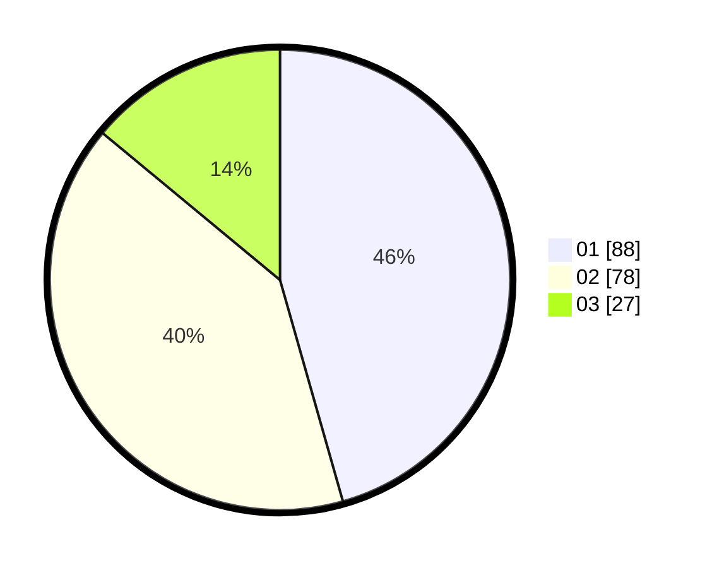

# Hasil

Hasil perolehan suara paslon dapat dilihat pada file paslon-01.txt, paslon-02.txt, dan paslon-03.txt.

Jika tidak ada, artinya data tersebut belum ada pada SIREKAP.

## Perolehan Suara

 * Paslon 01: **88**.
 * Paslon 02: **78**.
 * Paslon 03: **27**.

## Foto C Plano

https://sirekap-obj-formc.kpu.go.id/9a60/pemilu/ppwp/31/73/07/10/06/3173071006025-20240214-224315--1bcf380e-6b50-4abe-bf00-58c086f37565.jpg

https://sirekap-obj-formc.kpu.go.id/9a60/pemilu/ppwp/31/73/07/10/06/3173071006025-20240214-213618--ae9d7d14-9afc-45fe-847c-b6a55b6df930.jpg

https://sirekap-obj-formc.kpu.go.id/9a60/pemilu/ppwp/31/73/07/10/06/3173071006025-20240214-213838--0132fe35-3b6b-438f-886c-d3c3133a6e54.jpg

## DATA PEMILIH TETAP

Jumlah pemilih dalam DPT: **274**.
 * L: **141**.
 * P: **133**.

## DATA PENGGUNA HAK PILIH

Jumlah pengguna hak pilih dalam DPT: **186**.
 * L: **89**.
 * P: **97**.

Jumlah pengguna hak pilih dalam DPTb: **2**.
 * L: **0**.
 * P: **2**.

Jumlah pengguna hak pilih dalam DPK: **6**.
 * L: **1**.
 * P: **5**.

Jumlah pengguna hak pilih: **194**.
 * L: **90**.
 * P: **104**.

## JUMLAH SUARA SAH DAN TIDAK SAH

JUMLAH SELURUH SUARA SAH: **193**.

JUMLAH SUARA TIDAK SAH: **1**.

JUMLAH SELURUH SUARA SAH DAN SUARA TIDAK SAH: **194**.
