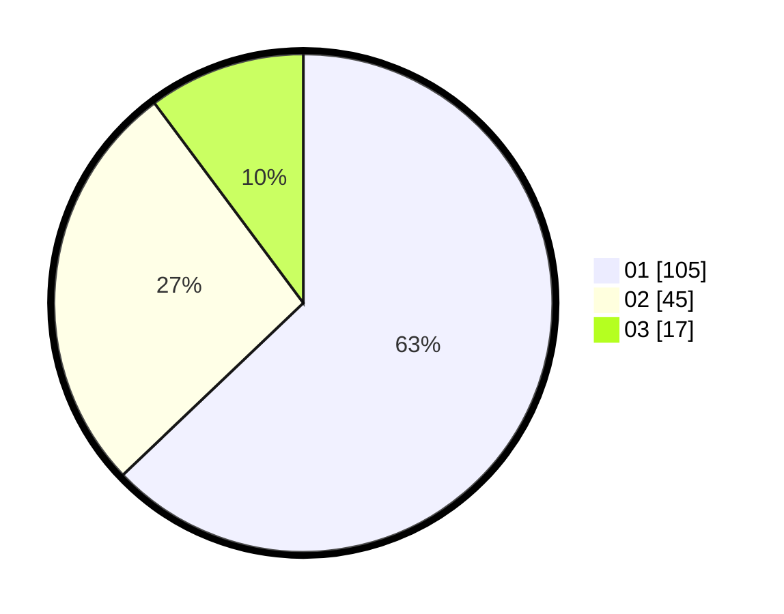

# Hasil

Hasil perolehan suara paslon dapat dilihat pada file paslon-01.txt, paslon-02.txt, dan paslon-03.txt.

Jika tidak ada, artinya data tersebut belum ada pada SIREKAP.

## Perolehan Suara

 * Paslon 01: **105**.
 * Paslon 02: **45**.
 * Paslon 03: **17**.

## Foto C Plano

https://sirekap-obj-formc.kpu.go.id/b8fd/pemilu/ppwp/31/73/07/10/06/3173071006026-20240214-195607--95620601-0e5b-4024-ba33-9b1d287ae995.jpg

https://sirekap-obj-formc.kpu.go.id/b8fd/pemilu/ppwp/31/73/07/10/06/3173071006026-20240214-195955--aad9b71b-cb36-48e1-b9e4-04ab78932a54.jpg

https://sirekap-obj-formc.kpu.go.id/b8fd/pemilu/ppwp/31/73/07/10/06/3173071006026-20240214-200321--75922420-ba9b-4531-8d97-c4ffd48b2f14.jpg
