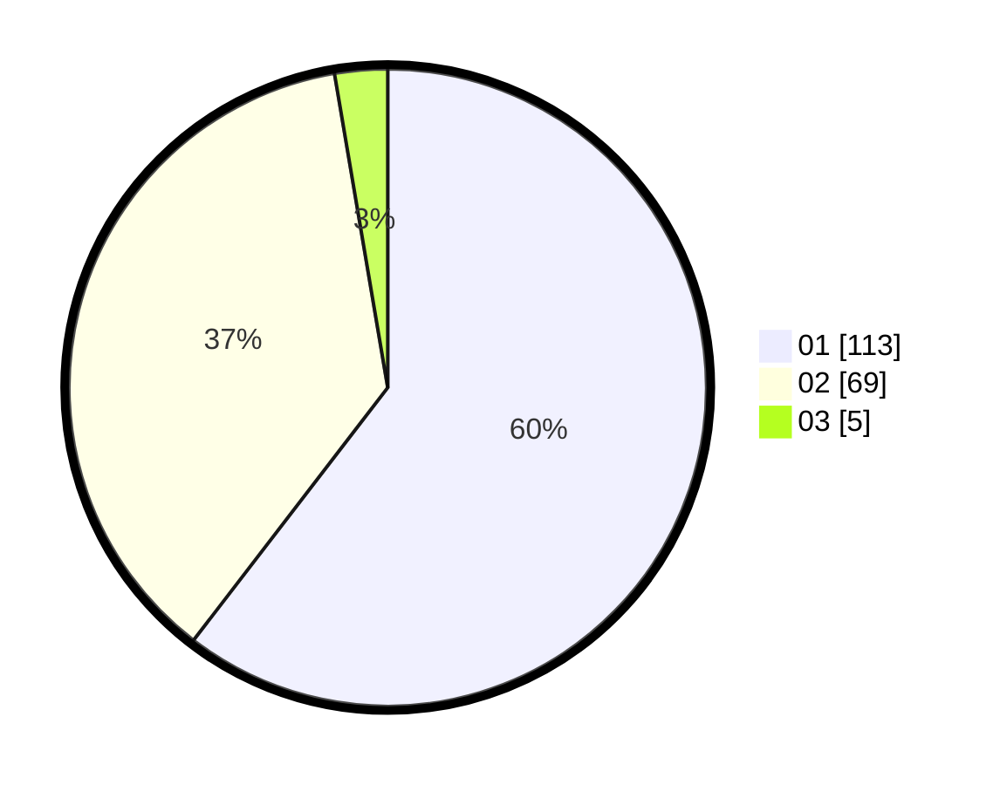

# Hasil

Hasil perolehan suara paslon dapat dilihat pada file paslon-01.txt, paslon-02.txt, dan paslon-03.txt.

Jika tidak ada, artinya data tersebut belum ada pada SIREKAP.

## Perolehan Suara

 * Paslon 01: **113**.
 * Paslon 02: **69**.
 * Paslon 03: **5**.

## Foto C Plano

https://sirekap-obj-formc.kpu.go.id/7ed1/pemilu/ppwp/31/73/07/10/06/3173071006027-20240214-195749--e7012de5-d34a-4532-8c43-bb8050542a5d.jpg

https://sirekap-obj-formc.kpu.go.id/7ed1/pemilu/ppwp/31/73/07/10/06/3173071006027-20240214-195923--fa88503f-25c7-4f2a-a801-5c8df2521920.jpg

https://sirekap-obj-formc.kpu.go.id/7ed1/pemilu/ppwp/31/73/07/10/06/3173071006027-20240214-200028--0bf9b79f-f81e-4f09-b20a-565c4ec6d7fb.jpg
