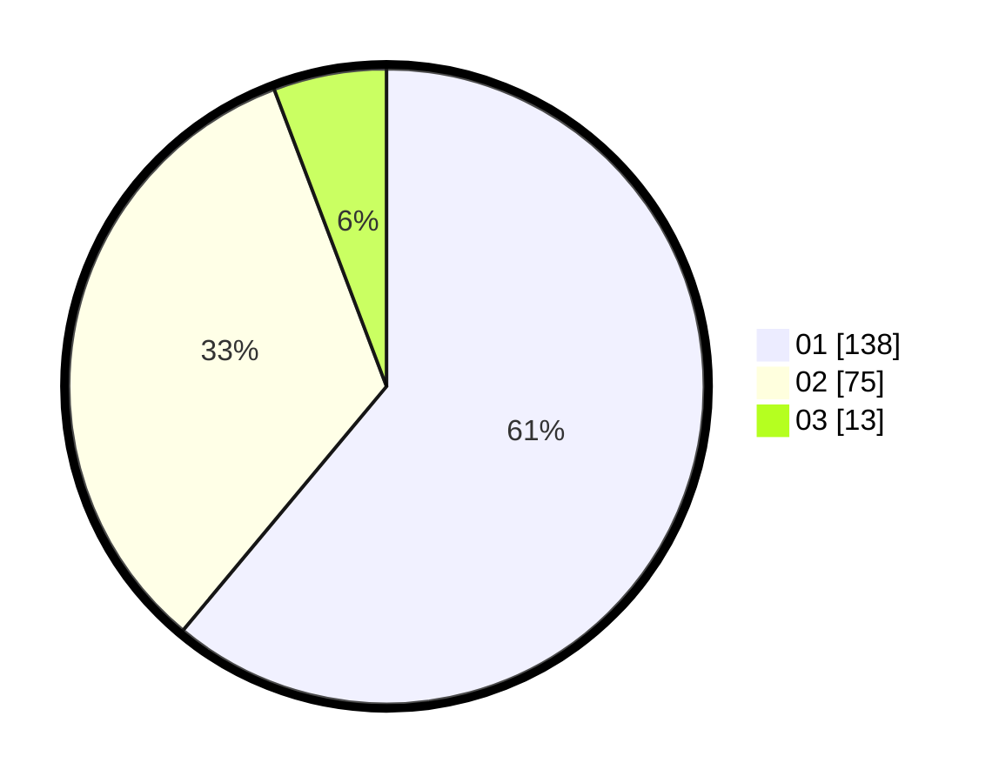

# Hasil

Hasil perolehan suara paslon dapat dilihat pada file paslon-01.txt, paslon-02.txt, dan paslon-03.txt.

Jika tidak ada, artinya data tersebut belum ada pada SIREKAP.

## Perolehan Suara

 * Paslon 01: **138**.
 * Paslon 02: **75**.
 * Paslon 03: **13**.

## Foto C Plano

https://sirekap-obj-formc.kpu.go.id/ddd6/pemilu/ppwp/31/73/07/10/06/3173071006031-20240215-024547--9604f1be-4e99-467a-a068-0e7baa2892d3.jpg

https://sirekap-obj-formc.kpu.go.id/ddd6/pemilu/ppwp/31/73/07/10/06/3173071006031-20240215-024637--47e42853-ebe6-4876-bbcf-baef1fd5c181.jpg

https://sirekap-obj-formc.kpu.go.id/ddd6/pemilu/ppwp/31/73/07/10/06/3173071006031-20240215-024716--43b58399-308d-4287-9a31-1d62791c8478.jpg
